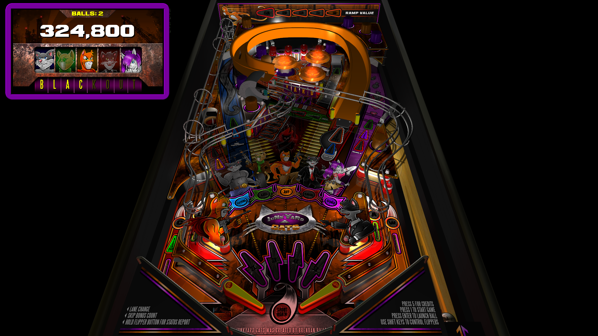

# Junkyard Cats (Bailey 2012)

Author(s): [Brendan Bailey](http://www.junkyardcats.net/index.php)  [javier1515](https://www.vpforums.org/index.php?showuser=37787)  
Version: Junkyard Cats_1.07.rar  
Download:  [VP Forums](https://www.vpforums.org/index.php?app=downloads&showfile=14106)

DirectB2S

Version: Junkyard Cats_1.07 (2 Screen).directB2S

Author(s): [Brendan Bailey](http://www.junkyardcats.net/index.php)  
Download:  Included in Junkyard Cats_1.07.rar

ROM:
No ROM Needed

Tested by:
[TechZombie]

## Status 

Minimum VPX Standalone build: 10.8.0-1983-b84441e
| Playfield | Controls | Backglass | DMD | ROM Required | FPS | 
|-----------|----------|-----------|-----|--------------|-----|
| :white_check_mark: | :white_check_mark: | :white_check_mark: | :x: | :x: | 54 |

## Instructions

- Copy the contents of this repo folder to your USB drive
- Add your personalized launcher.elf and rename it to vpx-junkyardcats.elf
- Download the table (Junkyard Cats_1.07.vpx) and directb2s (Junkyard Cats_1.07 (2 Screen).directB2S) and copy them into vpx-junkyardcats
- Make sure (.vpx), (.directb2s), (.ini) and (.vbs) files are all named the same
- "Join The Cats"

