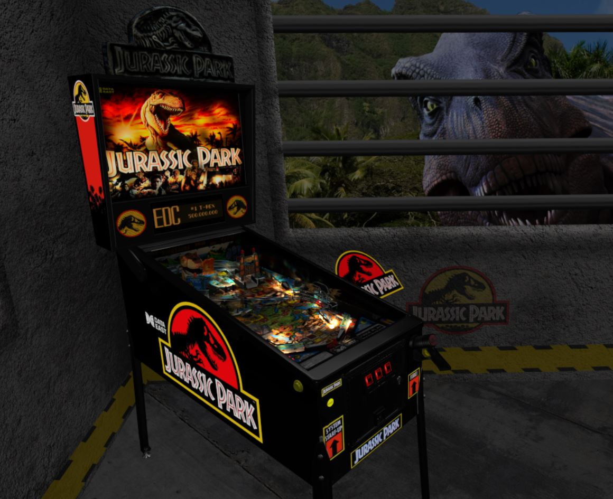

# Jurassic Park (Data East 1993)

Authors: [bigus1](https://www.vpforums.org/index.php?showuser=107629)  
Version: 1.1 
Download: [VP Forums](https://www.vpforums.org/index.php?app=downloads&showfile=16283)

DirectB2S

Authors: [hauntfreaks](https://vpuniverse.com/profile/5216-hauntfreaks/)  
Version: 1.5  
Download: [VP Universe](https://vpuniverse.com/files/file/12689-jurassic-park-data-east-1993-b2s-full-dmd/)

ROM

Download: [VP Forums](https://www.vpforums.org/index.php?app=downloads&showfile=11339)

**Testers:** [mcap] & [OminousOsie]

## Status 

Minimum VPX Standalone build: 10.8.0-1989-a764013

| Playfield | Controls | Backglass | DMD | ROM Required | FPS | 
|-----------|----------|-----------|-----|--------------|-----|
| :white_check_mark: | :white_check_mark: | :white_check_mark: | :white_check_mark: | :white_check_mark: | 36 |

## Instructions

- Copy the contents of this repo folder to your USB drive
- Add your personalized launcher.elf and rename it to vpx-jurassicpark.elf
- Download the table and directb2s versions listed above, extract (if necessary) and copy them to external/vpx-jurassicpark
- Make sure (.vpx), (.directb2s), and (.ini) files are all named the same
- Place ROM zip file into vpx-jurassicpark/pinmame/roms folder. DO NOT UNZIP!
