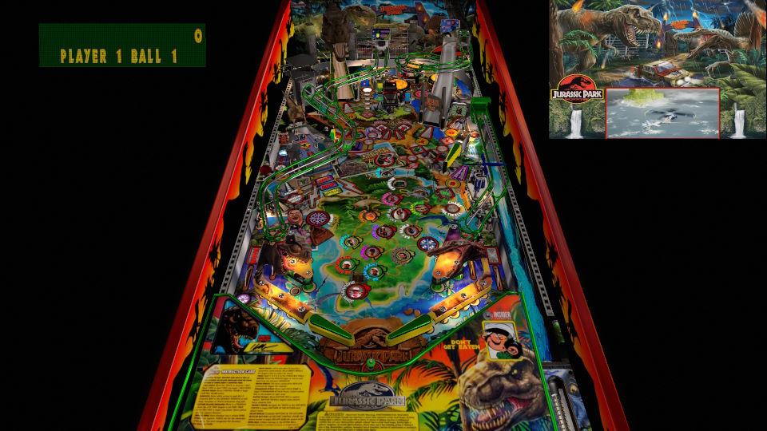

# Jurassic Park Pro LE (Stern 2019)

---

## Files
| File Type | Link | Version | Author | 
|-----------|--------|----------|--------------|
| **VPX** | [VPUniverse](https://vpuniverse.com/files/file/20502-jurassic-park-pro-le/) | 4.02 | [Marty02](https://vpuniverse.com/profile/16531-marty02/) |
| **B2S** | N/A | N/A | N/A |
| **DMD** | N/A | N/A | N/A |
| **ROM** | N/A | N/A | N/A |

**Tested by:** [mrandromeda]

---

## Status 
**Minimum VPX Standalone build:** 10.8.0-5b941e6
| Playfield | Controls | Backglass | DMD | ROM Required | FPS | 
|-----------|----------|-----------|-----|--------------|-----|
| :white_check_mark: | :white_check_mark: | :white_check_mark: | :white_check_mark: | :x: | 50 |

---

 

<table>
  <tr>
    <td style="background-color: #FFDDDD; padding: 0; border-left: 4px solid #FF0000;">
      

        <strong>⚠️ WARNING ⚠️</strong>
      

      

        Manually added puppacks are not supported by the VPXS 4KP team We will not be able to help you diagnose issues until this puppack is in the Wizard
      

    </td>
  </tr>
</table>

## Instructions

- Copy the contents of this repo folder to your USB drive
- Add your personalized launcher.elf and rename it to `vpx-jurassicparkle.elf`
- Download the table file `Pack Jurassic Park Pro Le 4.02.zip` version listed above.
- Extract from the zip the table `Jurassic Park Pro Le.vpx` and copy it into `vpx-jurassicparkle`
- Make sure `(.vpx)` `(.vbs)` and `(.ini)` are all named the same.
- Create the folder `pupvideos`.
- Download the puppack `PUPPACK jurassic Pro.zip` from the same table link listed above.
- Extract from the zip the folder `jurassic Pro` and place this folder in `pupvideos`.
- Unzip the `use_these_pup_files.zip` and place them inside the `pupvideos/jurassic Pro` folder, and overwrite files if prompted.
- An adventure 65 million years in the making

