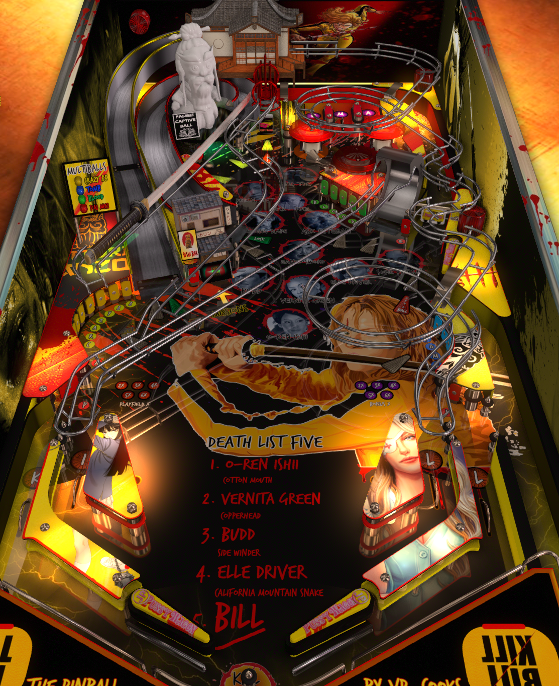

# Kill Bill (Original 2022)

Authors: [VP_Cooks](https://www.vpforums.org/index.php?showuser=180201)  
Version: 1.0.1  
Download: [VPUniverse](https://www.vpforums.org/index.php?app=downloads&showfile=16919)

DirectB2S

Authors: [marcobus2005](https://vpuniverse.com/profile/53087-marcobus2005/)  
Download: [VPUniverse](https://vpuniverse.com/files/file/14629-kill-bill-full-dmd/)

ROM

None

Tested by: Bruno15477 and evilwraith

## Status 

Minimum VPX Standalone build: 10.8.0-1989-a764013

| Playfield | Controls | Backglass | DMD | ROM Required | FPS | 
|-----------|----------|-----------|-----|--------------|-----|
| :white_check_mark: | :white_check_mark: | :white_check_mark: | :x: | :white_check_mark: | 60 |

## Instructions

- Copy the contents of this repo folder to your USB drive
- Add your personalized launcher.elf and rename it to vpx-killbill.elf
- Download the table and directb2s listed above, extract (if necessary) and copy to external/vpx-killbill
- Make sure (.vpx), (.directb2s), and (.ini) files are all named the same
