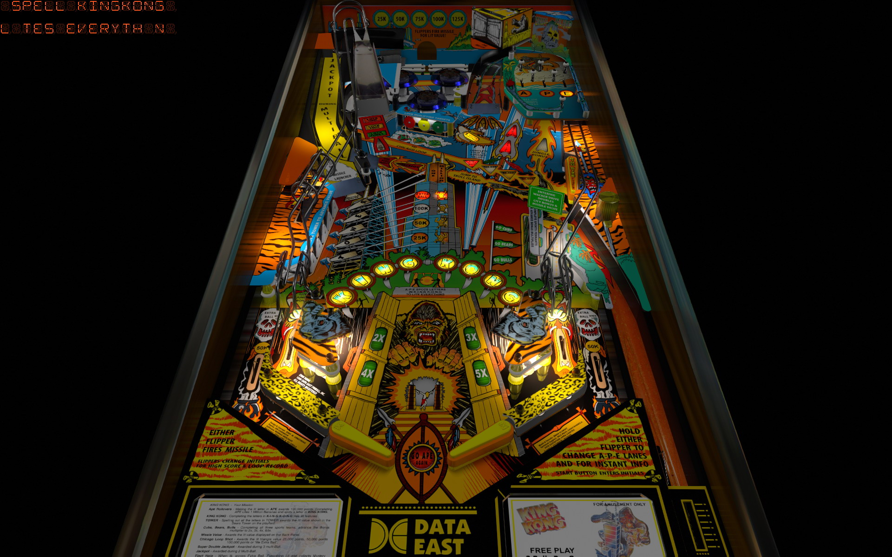

# King Kong (Data East 1990)

---

## Files
| File Type | Link | Version | Author | 
|-----------|--------|----------|--------------|
| **VPX** | [VP Forums](https://www.vpforums.org/index.php?app=downloads&showfile=16126) | 3.0 | [Bigus1](https://www.vpforums.org/index.php?showuser=107629) | 
| **B2S** | [VP Universe](https://vpuniverse.com/files/file/2538-king-kong-data-east-1990/) | 3.0 |[Wildman](https://vpuniverse.com/profile/5-wildman/) |
| **DMD** | - | - | - |
| **ROM** | [VP Forums](https://www.vpforums.org/index.php?app=downloads&showfile=8732) | kiko_a10.zip | [Destruk](https://www.vpforums.org/index.php?showuser=5) |

**Tested by:** [Bla1ze]

---

## Status 
**Minimum VPX Standalone build:** 10.8.0-1983-b84441e
| Playfield | Controls | Backglass | DMD | ROM Required | FPS | 
|-----------|----------|-----------|-----|--------------|-----|
| :white_check_mark: | :white_check_mark: | :white_check_mark: | :white_check_mark: | :white_check_mark: | 60 |

---

## Instructions

- Copy the contents of this repo folder to your USB drive
- Add your personalized launcher.elf and rename it to `vpx-kingkong.elf`
- Download the table and directb2s versions listed above, extract (if necessary) and copy them into `vpx-kingkong.elf`
- Make sure `(.vpx)` `(.direct2b2s)` `(.vbs)` and `(.ini)` are all named the same..
- "The Eighth wonder of the World!"