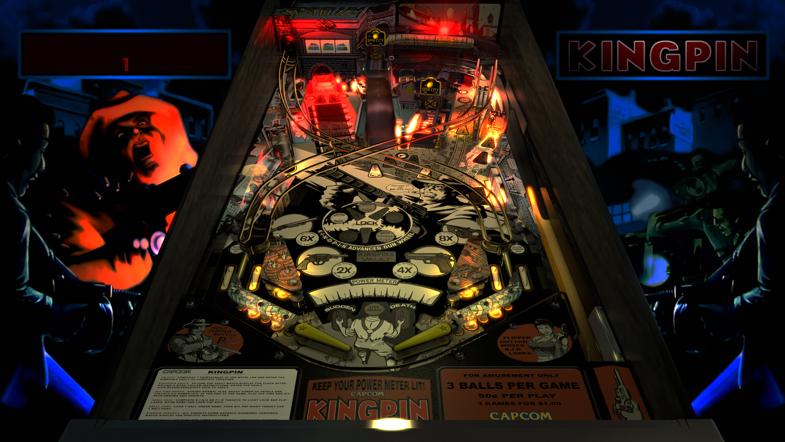

# Kingpin (Capcom 1996) (1920's Mod)
Tested by: kaoticBPR

Authors: [sg1bson](https://vpuniverse.com/profile/34010-sg1bson/)  
Version: 1.1  
Download: [vpuniverse](https://vpuniverse.com/files/file/7039-kingpin-capcom-1996-sg1bson-1920-mod/)

DirectB2S

Authors: [sg1bson](https://vpuniverse.com/profile/34010-sg1bson/)  
Version: 1.1  
Download: Included in table download

ROM

Download: [vpuniverse](https://vpuniverse.com/files/file/1815-kpb105zip/)  
ROM Name and version: kpb105

## Status 

Minimum VPX Standalone build: 10.8.0-1989-a764013

| Playfield | Controls | Backglass | DMD | ROM Required | FPS | 
|-----------|----------|-----------|-----|--------------|-----|
| :white_check_mark: | :white_check_mark: | :white_check_mark: | :white_check_mark: | :white_check_mark: | 42 |

## Instructions

- Install this table through the Table Manager, using the `Add Table` > `Manual` page
- If you need help, more information found on the wiki: [TM - Add Table - Manual](https://github.com/LegendsUnchained/vpx-standalone-alp4k/wiki/%5B04%5D-%F0%9F%A7%A1-TM-%E2%80%90-Other-Features#add-table---manual)
- If the table requires any additional files/steps, click `GO TO TABLE` after adding, and the TM will open to the relevant table folder.
- "Working for the kingpin, expect to be double crossed"

