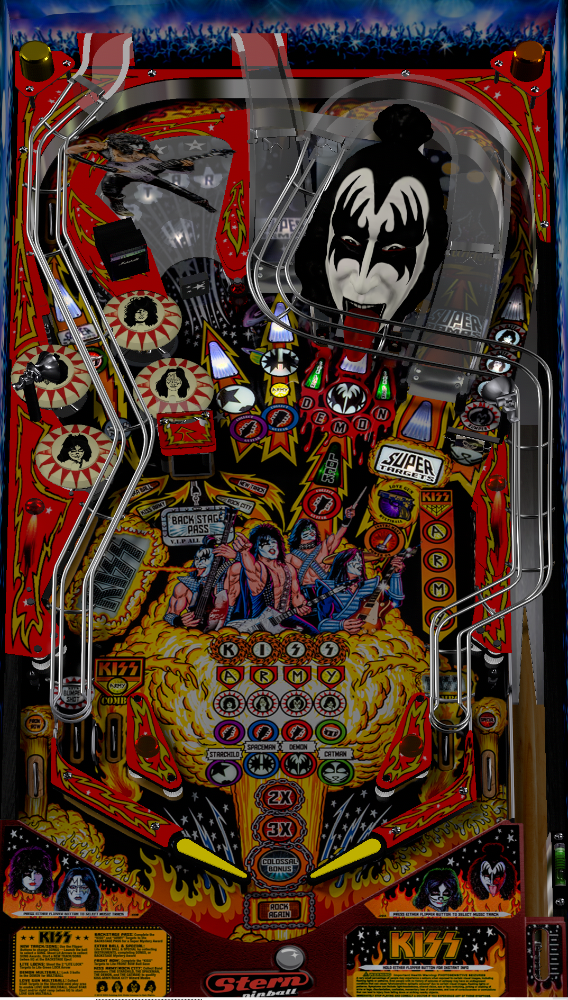

# KISS (Stern 2015)

Author: [Bigus1](https://www.vpforums.org/index.php?showuser=107629)  
Version: 1.1  
Download: [VP Forums](https://www.vpforums.org/index.php?app=downloads&showfile=17738)

**DirectB2S**
Author: [Wildman](https://vpuniverse.com/profile/5-wildman/)  
Download [VP Universe](https://vpuniverse.com/files/file/4321-kiss-stern-2015/)

**UltraDMD**
Author: [balutito](https://vpuniverse.com/profile/36070-balutito/)
File: kiss install.rar (ignore the .vpx file)
Download [VP Universe](https://vpuniverse.com/files/file/10614-kiss-stern-balutito-le/?do=download)

Tested by: Mar3nBu

## Status 

Minimum VPX Standalone build: 10.8.0-1983-b84441e

| Playfield | Controls | Backglass | DMD | ROM Required | FPS | 
|-----------|----------|-----------|-----|--------------|-----|
| :white_check_mark: | :white_check_mark: | :white_check_mark: | :white_check_mark: | :x: | 57 |

## Instructions

- Install this table through the Table Manager, using the `Add Table` > `Manual` page
- If you need help, more infomation found on the wiki: [TM - Add Table - Manual](https://github.com/LegendsUnchained/vpx-standalone-alp4k/wiki/%5B04%5D-%F0%9F%A7%A1-TM-%E2%80%90-Other-Features#add-table---manual)
- If the table requires any additional files/steps, click `GO TO TABLE` after adding, and the TM will open to the relevant table folder.
- Extract "kiss install.rar" and place the KISS.UltraDMD folder in external/vpx-kiss. Ignore the Music folder and all other files in the extracted "kiss install" folder. You do not need them for this mod.

## Buttons

- Left flipper = select city
- Right flipper = select song

