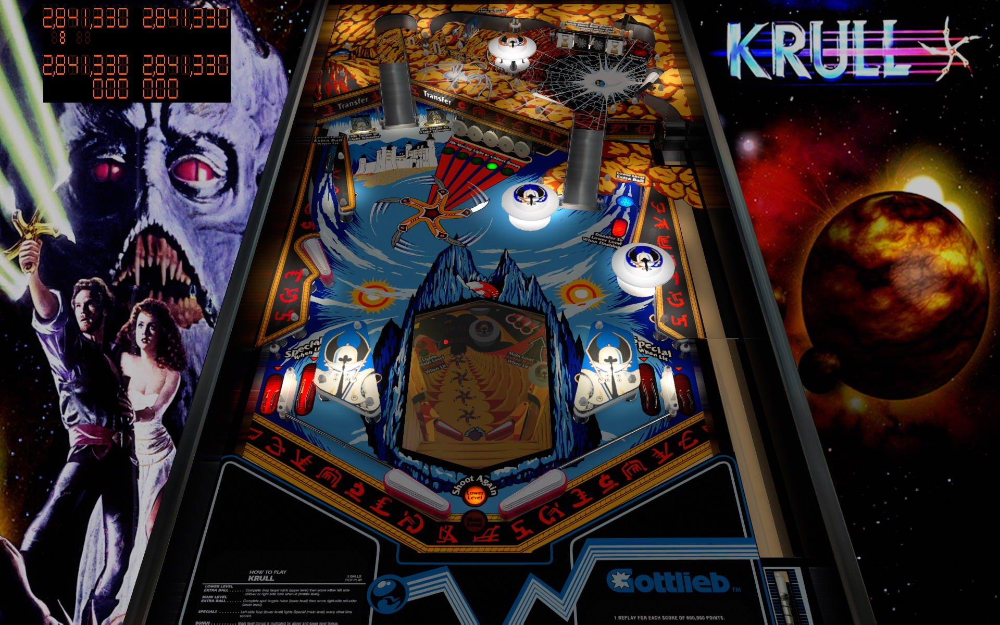

# Krull (Gottlieb 1983)

Author(s): [bigus1](https://www.vpforums.org/index.php?showuser=107629)  
Version:  Krull (Gottlieb 1983)_Bigus(MOD)1.0.vpx.zip  
Download:  [VP Forums](https://www.vpforums.org/index.php?app=downloads&showfile=15479)

DirectB2S

Author(s): [Hysteric](https://www.vpforums.org/index.php?showuser=90173)  
Version: Krull_db2s_v2.zip  
Download:  [VP Forums](https://www.vpforums.org/index.php?app=downloads&showfile=10274)

ROM:  
krull.zip

Author(s): [Rock-ola]  
Download:  [Pinball Nirvana](https://pinballnirvana.com/forums/resources/krull.2011/)

Tested by:  
[TechZombie]

## Status 

Minimum VPX Standalone build: 10.8.0-1983-b84441e  

| Playfield | Controls | Backglass | DMD | ROM Required | FPS | 
|-----------|----------|-----------|-----|--------------|-----|
| :white_check_mark: | :white_check_mark: | :white_check_mark: | :white_check_mark: | :white_check_mark: | 57 |

## Instructions

- Install this table through the Table Manager, using the `Add Table` > `Manual` page
- If you need help, more infomation found on the wiki: [TM - Add Table - Manual](https://github.com/LegendsUnchained/vpx-standalone-alp4k/wiki/%5B04%5D-%F0%9F%A7%A1-TM-%E2%80%90-Other-Features#add-table---manual)
- If the table requires any additional files/steps, click `GO TO TABLE` after adding, and the TM will open to the relevant table folder.
- "These are the sands of my life. Accept them and the spider will have no power to harm you." ---Widow of the Web

