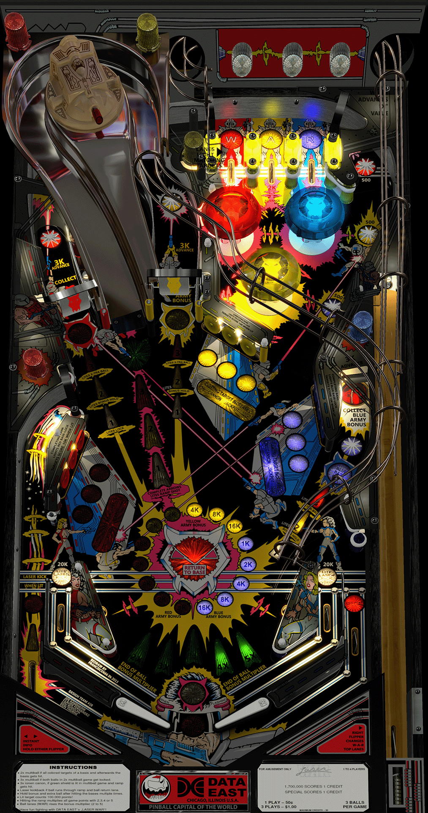

# Laser War (Data East 1987)

Author(s): [UnclePaulie](https://vpuniverse.com/profile/16685-unclepaulie/)
  
Version:  Laser War (Data East 1987) w VR Room 2.0.0

Download:  [VP Universe](https://vpuniverse.com/files/file/10506-laser-war-data-east-1987-w-vr-room/)

DirectB2S

Authors: [hauntfreaks](https://vpuniverse.com/profile/5216-hauntfreaks/)

Version: Laser War (Data East 1987) alt2 full dmd

Download: [VP Universe](https://vpuniverse.com/files/file/13593-laser-war-data-east-1987-alt2-standardfull-dmd/)

ROM: Laser War (8.3)

Authors: [destruk](https://www.vpforums.org/index.php?showuser=5)

Version: lwar_a83.zip

Download: [VP Forums](https://www.vpforums.org/index.php?app=downloads&showfile=813)

Tested by:
[CoffeeAtJoes]

## Status 

Minimum VPX Standalone build: 10.8.0-1983-b84441e
| Playfield | Controls | Backglass | DMD | ROM Required | FPS | 
|-----------|----------|-----------|-----|--------------|-----|
| :white_check_mark: | :white_check_mark: | :white_check_mark: | :white_check_mark: | :white_check_mark: | 29 |

## Instructions

- Install this table through the Table Manager, using the `Add Table` > `Manual` page
- If you need help, more information found on the wiki: [TM - Add Table - Manual](https://github.com/LegendsUnchained/vpx-standalone-alp4k/wiki/%5B04%5D-%F0%9F%A7%A1-TM-%E2%80%90-Other-Features#add-table---manual)
- If the table requires any additional files/steps, click `GO TO TABLE` after adding, and the TM will open to the relevant table folder.
- "Knowing is half the battle... the other half is red and blue (& yellow) lasers!"

