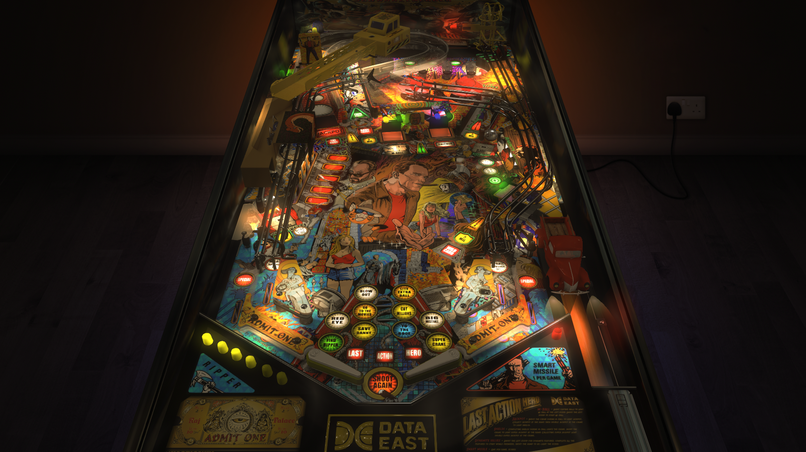

# Last Action Hero (Balutito MOD)

Author(s): [balutito](https://vpuniverse.com/profile/36070-balutito/)  
Version:  Last Action Hero Balutito MOD.vpx  
Download: [VPUniverse](https://vpuniverse.com/files/file/11068-last-action-hero-balutito-mod/)

DirectB2S

Author(s): [balutito](https://vpuniverse.com/profile/36070-balutito/)  
Version: Last Action Hero Balutito Mod.directb2s  
Download: [VPUniverse](https://vpuniverse.com/files/file/11069-last-action-hero-alternative-b2s/)

ROM

lah_112.zip

Author(s): [destruk](https://www.vpforums.org/index.php?showuser=5)  
Download: [VP Forums](https://www.vpforums.org/index.php?app=downloads&showfile=856)

Tested by:
[TechZombie]

## Status 

Minimum VPX Standalone build: 10.8.0-1983-b84441e

| Playfield | Controls | Backglass | DMD | ROM Required | FPS | 
|-----------|----------|-----------|-----|--------------|-----|
| :white_check_mark: | :white_check_mark: | :white_check_mark: | :white_check_mark: | :white_check_mark: | 50 |

## Instructions

- Copy the contents of this repo folder to your USB drive
- Add your personalized launcher.elf and rename it to vpx-lastactionhero.elf
- Download the table and directb2s versions listed above, extract them (if necessary) and copy them into vpx-lastactionhero
- Rom file (lah_112.zip) stays in zip folder, place zip file in vpx-lastactionhero/pinmame/roms
- Make sure (.vpx) (.direct2b2s) and (.ini) are all named the same. 
- Jack Slater: "Sir, are you a henchman?"   Benedict: "No, I only go as far as lackey. Anything else?"

