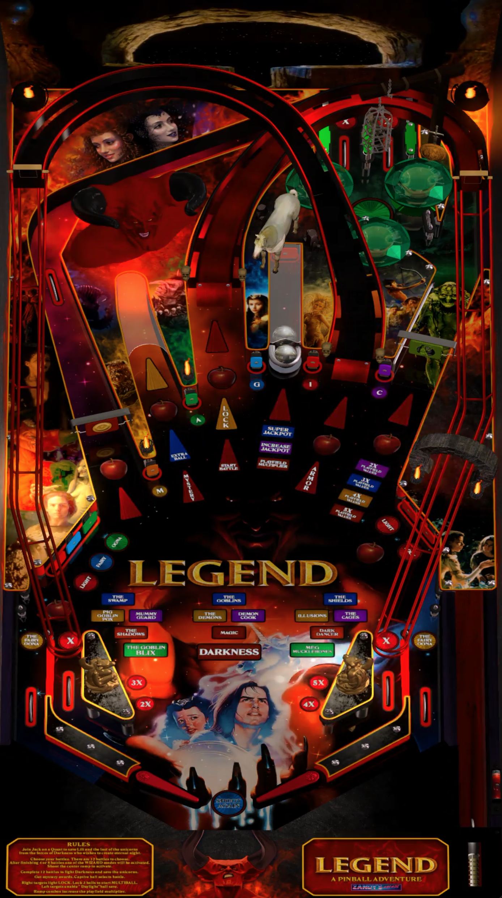

# Legend - A Pinball Adventure (Original 2023)

Authors: [ZandysArcade](https://vpuniverse.com/profile/57949-zandysarcade/)  
Filename: LEGEND_2.0.vpx & legend.zip (Unzip)  
Info: [VP Forums](https://vpuniverse.com/files/file/16197-legend-a-pinball-adventure/)  
Download: [Google Drive](https://drive.google.com/drive/folders/17mLWdBpKmHc9OlX44tR5DMFMqtz2bCjW)

DirectB2S included in legend.zip/MEDIA PACK

No ROM needed

Tested by: TechZombie

## Status 

Minimum VPX Standalone build: 10.8.0-1989-a764013

| Playfield | Controls | Backglass | DMD | ROM Required | FPS | 
|-----------|----------|-----------|-----|--------------|-----|
| :white_check_mark: | :white_check_mark: | :white_check_mark: | :white_check_mark: | :white_check_mark: | 54 |

## Instructions

- Install this table through the Table Manager, using the `Add Table` > `Manual` page
- If you need help, more infomation found on the wiki: [TM - Add Table - Manual](https://github.com/LegendsUnchained/vpx-standalone-alp4k/wiki/%5B04%5D-%F0%9F%A7%A1-TM-%E2%80%90-Other-Features#add-table---manual)
- If the table requires any additional files/steps, click `GO TO TABLE` after adding, and the TM will open to the relevant table folder.
- "I require the solace of the shadows and the dark of the night. Sunshine is my destroyer." - Darkness

