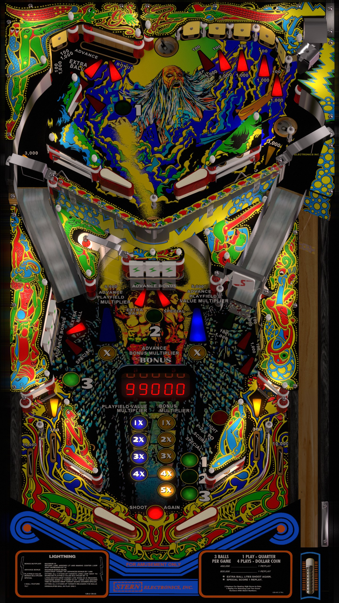

# Lightning (Stern 1981)

Authors: [jpsalas](hhttps://www.vpforums.org/index.php?showuser=277)  
Version: 4.0.1  
Download: [VPForums](https://www.vpforums.org/index.php?app=downloads&showfile=13028)

DirectB2S

Authors: [hauntfreaks](https://vpuniverse.com/profile/5216-hauntfreaks/)  
Download: [VPUniverse](https://vpuniverse.com/files/file/19261-lightning-stern-1981-b2s/)

ROM

ROM Name: lightnin.zip  
Download: [VPForums](https://www.vpforums.org/index.php?app=downloads&showfile=750)  

SHA1: 7E07A927618A5C6D409804A20D8379CEB6406BC6  
MD5:  4BAEBE7AB6AE493A7CA400B967ED6FB8 

Tested by: evilwraith

## Status 

Minimum VPX Standalone build: 10.8.0-1989-a764013

| Playfield | Controls | Backglass | DMD | ROM Required | FPS | 
|-----------|----------|-----------|-----|--------------|-----|
| :white_check_mark: | :white_check_mark: | :white_check_mark: | :x: | :white_check_mark: | 60 |

## Instructions

- Make sure to use the Table Manager to install this table.
- Instructions can be found on the wiki [Add Table - Manual](https://github.com/LegendsUnchained/vpx-standalone-alp4k/wiki/%5B04%5D-%F0%9F%A7%A1-TM-%E2%80%90-Other-Features#add-table---manual)
- If the table requires any additional files/steps, click `GO TO TABLE` after adding, and the TM will open to the relevant table folder.

