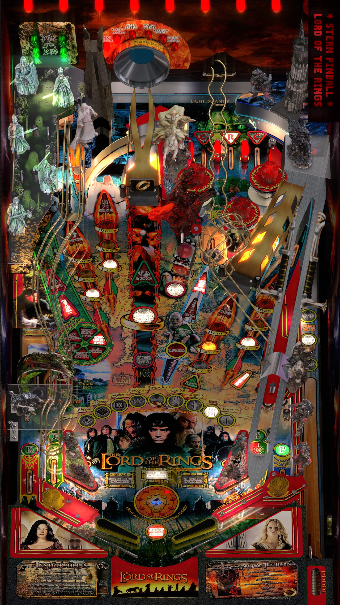

# Lord of the Rings, JP's The (Original 2017)

 

## *️⃣  Table Statistics

| Playfield | Controls | Backglass | DMD | ROM Required | FPS | 
|-----------|----------|-----------|-----|--------------|-----|
| :white_check_mark: | :white_check_mark: | :white_check_mark: | :white_check_mark: | :white_check_mark: | 60 |

 

**VPXS 4KP Testers:**
  - Ominous Osie 🌸

 

---

 

## ❇️ Available in the Wizard! 🪄✨

 

This table is available through the Table Manager Wizard, which makes installation quick and easy!

### How to install:

1.  Open the **Table Manager**
2.  Click the **Add Table** button
3.  Select the **Wizard** tab
4.  Find and select this table from the dropdown menu: **`Lord of the Rings, JP's The`**
5.  Follow the on-screen instructions to download and upload the required files
6. *"It's a dangerous business, Frodo, going out your door..."*

 

Using the Wizard ensures you get the latest table version, have all required files (ROM, backglass, etc.), and have all the VPXS 4KP team's table tweaks and improvements!

 

__*We hope you enjoy!!*__

*The VPXS 4KP Wizard team:*
<pre>
- n-i-x            - Mox
- Boris Undead     - 'Coffee' Joe     - Ominous Osie 🌸
- Bla1ze           - evilwraith       - Silentkat        
- mrandromeda      - SScorpio         - TechZombie
</pre>

 

---

 

## ➕ Optional Extras

> All optional extras can be added to the table after the Wizard installation via: 
> -  Clicking `"Go to table"` directly after wizard installation
> -  Navigate to the table folder using the `USB Root` tab.

 

### 🎦 Puppack (Backglass Videos/Music):

1. Download the `lotr_1.0.1.zip` puppack from [Mega](https://mega.nz/file/7BdSXbQJ#ReZzIrRvpYc2nyHMQjZSp2s91fZ7ly5YOVy5c12zg4U) (by [takut](https://vpuniverse.com/profile/3434-takut/))
2. Create the folders `pupvideos/lotr` within the `external/vpx-lordoftherings` folder in the Table Manager
3. Extract the contents of the `lotr_1.0.1.zip` from the puppack zip, and put it in the `external/vpx-lordoftherings/pupvideos/lotr` folder. 
4. You should now have `external/vpx-lordoftherings/pupvideos/lotr/{puppack files}`
5. Unzip the `use_these_pup_files.zip` from the `external/vpx-lordoftherings` folder in the [repository](https://github.com/LegendsUnchained/vpx-standalone-alp4k/tree/main/external/vpx-lordoftherings)
6. Place them inside the `external/vpx-lordoftherings/pupvideos`, and overwrite files if prompted. __This is necessary otherwise the table crashes after a while and your playfield will blink.__
7. __Delete the directb2s file because this is not needed anymore and makes the backglass blink.__
8. Download the `altsound_lotr_Sjoend_normalized.zip` altsound from [Mega](https://mega.nz/file/rnJCCZRD#wLnMhIKqTID9y8KHSYDlIJ4RpeiUPTOZ698N4mat-BY) (by Sjoend)
9. Create the folders `pinmame/altsound/lotr` within the `external/vpx-lordoftherings` folder in the Table Manager 
10. extract the files from the zip in the folder `LOTR_Sjoend_normalized` into this folder.
11. Enjoy this amazing table with extra sounds and videos! 

 
 
 
 
 
