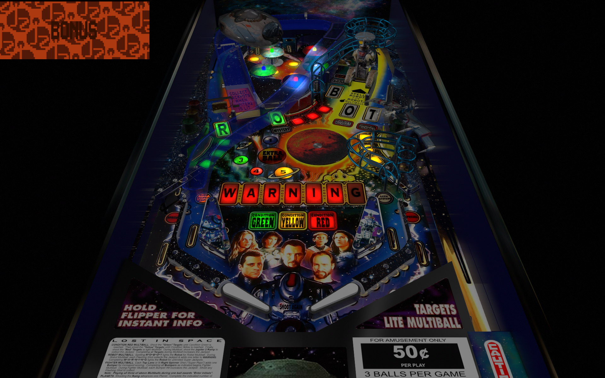

# Lost in Space (Sega 1998) Bigus(MOD) 2.0

Table

Author: [bigus1](https://www.vpforums.org/index.php?showuser=107629)  
Filename:  Lost in Space (Sega 1998)_Bigus(MOD)2.0.vpx.zip  
VPX Version: (Version 2.0) Lost in Space (Sega 1998)_Bigus(MOD)2.0.vpx  
Download: [VP Forums](https://www.vpforums.org/index.php?app=downloads&showfile=14812)

Backglass

Author: [hauntfreaks](https://www.vpforums.org/index.php?showuser=73849)  
Filename: Lost In Space (Sega 1998).rar  
directb2s Version: (Version 1.0.0) Lost In Space (Sega 1998).directb2s  
Download: [VPUniverse](https://vpuniverse.com/files/file/19526-lost-in-space-sega-1998-b2s-full-dmd/?tab=comments)

ROM

Author: [destruk](https://www.vpforums.org/index.php?showuser=5)  
Lost in Space - ROM  
Filename: lostspc.zip  
Download: [VP Forums](https://www.vpforums.org/index.php?app=downloads&showfile=183)

MD5: 2BC7D3E396F4E97A5ADB79D06854FCF6  
SHA-1: 9E83FF68E8843A139FF878870C27E8DBBE8C4347
  
Tested by:  
[TechZombie]

## Status 

Minimum VPX Standalone build: 10.8.0-1983-b84441e

| Playfield | Controls | Backglass | DMD | ROM Required | FPS | 
|-----------|----------|-----------|-----|--------------|-----|
| :white_check_mark: | :white_check_mark: | :white_check_mark: | :white_check_mark: | :white_check_mark: | 60 |

## Instructions

- Make sure to use the Table Manager to install this table.
- Instructions can be found on the wiki [Add Table - Manual](https://github.com/LegendsUnchained/vpx-standalone-alp4k/wiki/%5B04%5D-%F0%9F%A7%A1-TM-%E2%80%90-Other-Features#add-table---manual)
- If the table requires any additional files/steps, click `GO TO TABLE` after adding, and the TM will open to the relevant table folder.
- "Danger, Will Robinson! Danger!" - Robot

