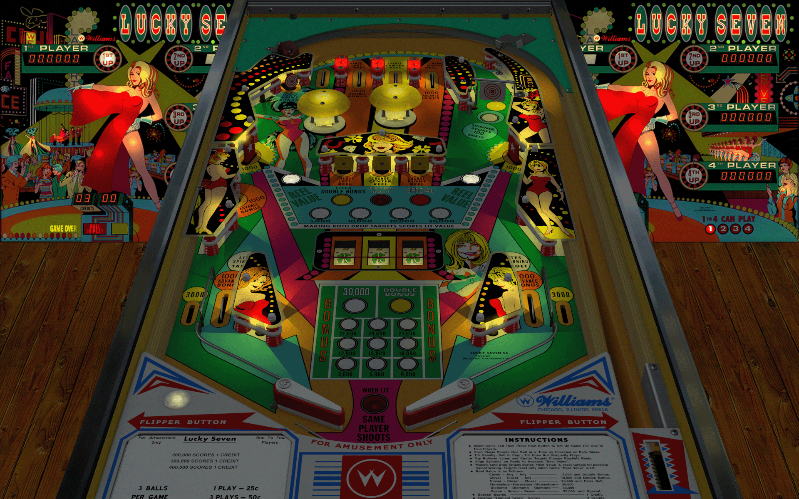

# Lucky Seven (Williams 1978)

Author: [kiwi](https://www.vpforums.org/index.php?showuser=30913)  
Version: 1.2.2   
Download: [vpforums](https://www.vpforums.org/index.php?app=downloads&showfile=12371)

DirectB2S
Author: [kiwi](https://www.vpforums.org/index.php?showuser=30913)  
Version 1.0.0   
Download: [vpforums](https://www.vpforums.org/index.php?app=downloads&showfile=12372)

ROM  
Download: [vpforums](https://www.vpforums.org/index.php?app=downloads&showfile=767)  
ROM Name and version: lucky_l1.zip  

  
Tested by:  
[psybocilin]

## Status 

Minimum VPX Standalone build: 10.8.0-1989-a764013

| Playfield | Controls | Backglass | DMD | ROM Required | FPS | 
|-----------|----------|-----------|-----|--------------|-----|
| :white_check_mark: | :white_check_mark: | :white_check_mark: | :white_check_mark: | :white_check_mark: | 60 |

## Instructions

- "Life is a gamble, darling, and sometimes the only way to win is to bet on yourself."
