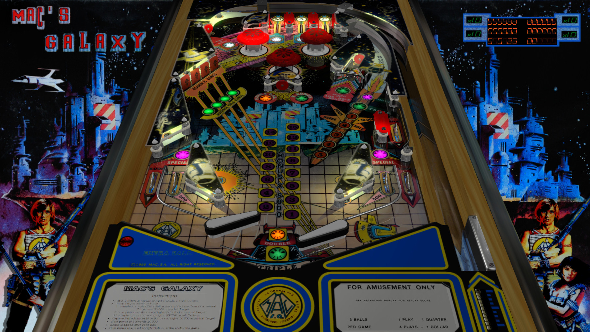

# Mac's Galaxy (MAC 1986)

---

## Files
| File Type | Link | Version | Author | 
|-----------|--------|----------|--------------|
| **VPX** | [VPForums](https://www.vpforums.org/index.php?app=downloads&showfile=13144) | 1.3 | [mfuegemann](https://www.vpforums.org/index.php?s=959a5af655428408ec86e1ebcb8d58c8&showuser=5944) |
| **B2S** | [VPForums](https://www.vpforums.org/index.php?app=downloads&showfile=13143) | 1.0 | [mfuegemann](https://www.vpforums.org/index.php?s=959a5af655428408ec86e1ebcb8d58c8&showuser=5944) |
| **DMD** | Use 2-screen b2s | N/A | N/A |
| **ROM** | [VPUniverse](https://vpuniverse.com/files/file/3971-macs-galaxy/) | ? | [Maguinas Automaticas Computerizadas, S.A. (MAC)](https://pinside.com/pinball/machine?query=&manufacturer[]=44#results) |

**Tested by:** [Curt](https://github.com/Old-Cyrus)

---

## Status 
**Minimum VPX Standalone build:** 10.8.0-1989-a764013

| Playfield | Controls | Backglass | DMD | ROM Required | FPS | 
|-----------|----------|-----------|-----|--------------|-----|
| :white_check_mark: | :white_check_mark: | :white_check_mark: | :x: | :white_check_mark: | 60 |

---

## Instructions

- Copy the contents of this repo folder to your USB drive
- Add your personalized launcher.elf and rename it to `vpx-macgalaxy.elf`
- Download the table and directb2s versions listed above, extract (if necessary) and copy them into `vpx-macgalaxy`
- Rom file (macgalxy.zip) stays in zip folder, place zip file in `vpx-macgalaxy/pinmame/roms`
- Make sure `(.vpx)` `(.directb2s)` `(.vbs)` and `(.ini)` are all named the same. Do not rename VPinballX.ini.

