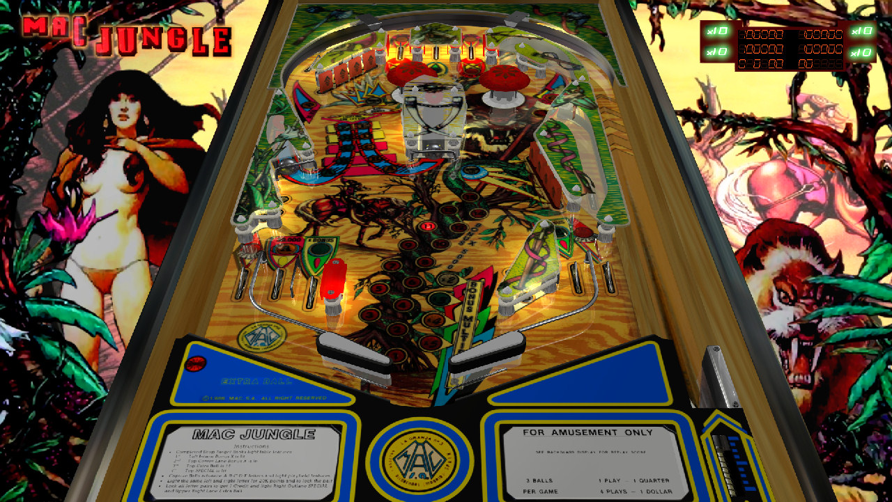

# Mac Jungle (MAC 1987)

---

## Files
| File Type | Link | Version | Author | 
|-----------|--------|----------|--------------|
| **VPX** | [VPForums](https://www.vpforums.org/index.php?app=downloads&showfile=14037) | 1.1 | [mfuegemann](https://www.vpforums.org/index.php?s=959a5af655428408ec86e1ebcb8d58c8&showuser=5944) |
| **B2S** | [VPUniverse](https://vpuniverse.com/files/file/15188-mac-jungle-mac-1987/) | 2scr | [Wildman](https://vpuniverse.com/profile/5-wildman/) |
| **DMD** | Use 2-screen b2s | N/A | N/A |
| **ROM** | [VPUniverse](https://vpuniverse.com/files/file/4830-mac-jungle/) | ? | [Maguinas Automaticas Computerizadas, S.A. (MAC)](https://pinside.com/pinball/machine?query=&manufacturer[]=44#results) |

**Tested by:** [Curt](https://github.com/Old-Cyrus)

---

## Status 
**Minimum VPX Standalone build:** 10.8.0-1989-a764013

| Playfield | Controls | Backglass | DMD | ROM Required | FPS | 
|-----------|----------|-----------|-----|--------------|-----|
| :white_check_mark: | :white_check_mark: | :white_check_mark: | :x: | :white_check_mark: | 60 |

---

## Instructions

- Make sure to use the Table Manager to install this table.
- Instructions can be found on the wiki [Add Table - Manual](https://github.com/LegendsUnchained/vpx-standalone-alp4k/wiki/%5B04%5D-%F0%9F%A7%A1-TM-%E2%80%90-Other-Features#add-table---manual)
- If the table requires any additional files/steps, click `GO TO TABLE` after adding, and the TM will open to the relevant table folder.

