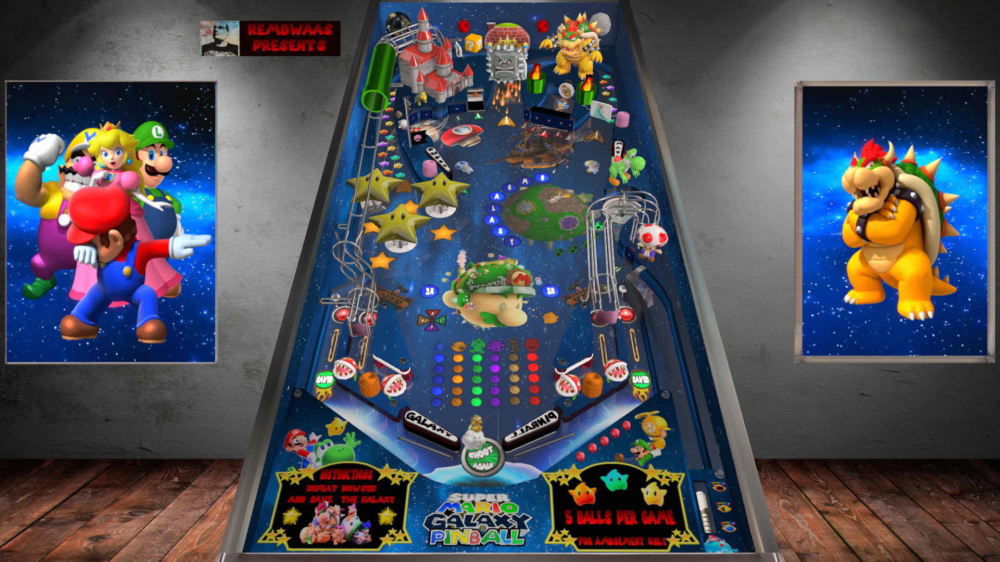

# Super Mario Galaxy (Original 2021)

---

## Files
| File Type | Link | Version | Author | 
|-----------|--------|----------|--------------|
| **VPX** | [VP Universe](https://vpuniverse.com/files/file/8403-super-mario-galaxy-pinball/) | 1.3 | [remdwaas1986](https://vpuniverse.com/profile/28048-remdwaas1986/) |
| **B2S** | [VP Universe](https://vpuniverse.com/files/file/8403-super-mario-galaxy-pinball/) | 1.3 | [remdwaas1986](https://vpuniverse.com/profile/28048-remdwaas1986/) |

**Tested by:** (Silentkat & Boris & TheOminousOsie)

---

## Status 
**Minimum VPX Standalone build:** {10.8.0-1983-b84441e}

| Playfield | Controls | Backglass | DMD | ROM Required | FPS | 
|-----------|----------|-----------|-----|--------------|-----|
| :white_check_mark: | :white_check_mark: | :white_check_mark: | :white_check_mark: | :x: | 58 |

---

## Instructions

- Copy the contents of this repo folder to your USB drive
- Add your personalized launcher.elf and rename it to `vpx-mariogalaxy.elf`
- Download the table and directb2s versions listed above, (Use the directb2s version named SMGP other versions of backglass untested) extract (if necessary) and copy them into `vpx-mariogalaxy`
- Make sure `(.vpx)` `(.direct2b2s)` `(.vbs)` and `(.ini)` are all named the same. Do NOT rename VPReg.ini file.
- It's a me MARIO!!!

