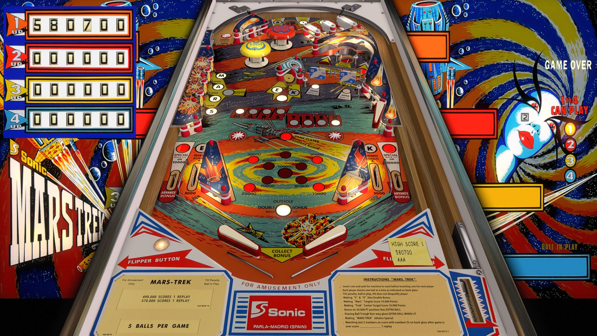

# Mars Trek (Sonic 1977)

## Files
| File Type | Link | Version | Author | 
|-----------|--------|----------|--------------|
| **VPX** | [VPForums](https://www.vpforums.org/index.php?app=downloads&showfile=17414) | 1.2 | [klodo81](https://www.vpforums.org/index.php?s=7cf1ee36391b205ff61946392cdc9dcb&showuser=44515) |
| **B2S** | [VPForums](https://www.vpforums.org/index.php?app=downloads&showfile=17414) | 1.1 | [klodo81](https://www.vpforums.org/index.php?s=7cf1ee36391b205ff61946392cdc9dcb&showuser=44515) |
| **DMD** | Not Needed | Not Needed | Not Needed |
| **ROM** | Not Needed | Not Needed | Not Needed |

**Tested by:** [vicpac73]

---

## Status 
**Minimum VPX Standalone build:** {vpx-standalone-build-#}

| Playfield | Controls | Backglass | DMD | ROM Required | FPS | 
|-----------|----------|-----------|-----|--------------|-----|
| :white_check_mark: | :white_check_mark: | :white_check_mark: | :x: | :x: | 60 |

---

## Instructions

