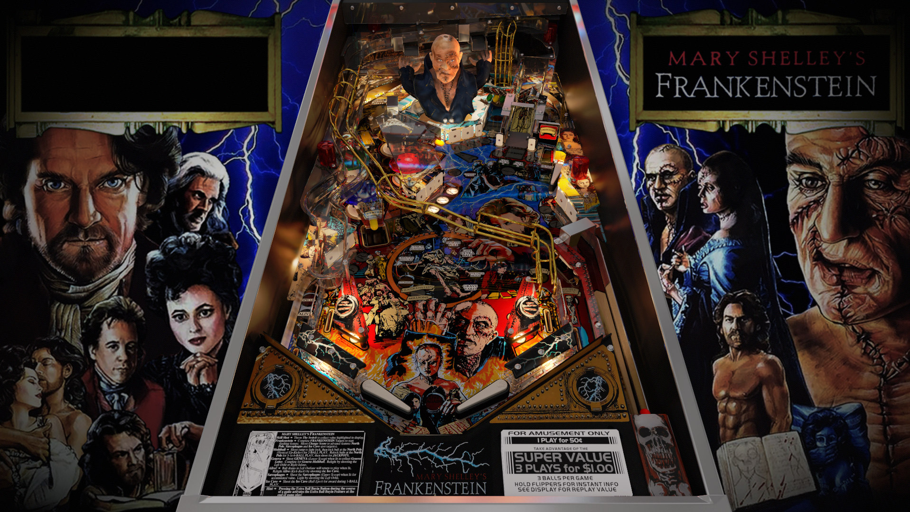

# Mary Shelley's Frankenstein (Sega 1995)

Authors: [schlabber34](https://vpuniverse.com/profile/11680-schlabber34/)
Version: 1.2.2
Download: [VPUniverse](https://vpuniverse.com/files/file/5763-mary-shelleys-frankenstein-sega-1995/)

DirectB2S

Authors: [wildman](https://vpuniverse.com/profile/5-wildman/)
Download: [VP Universe](https://vpuniverse.com/files/file/4399-mary-shelleys-frankenstein-sega-1995/)

ROM

Download: [vpforums](https://www.vpforums.org/index.php?app=downloads&showfile=238)
Rom Name: frankst.zip
SHA1: 3B2DEBB61B184A4A5A5216C09247279B6FE16A4C
MD5: F5FE10836EEB802498C4E6D50AD00D95

Tested by: kaoticBPR and evilwraith

## Status 

Minimum VPX Standalone build: 10.8.0-1989-a764013
| Playfield | Controls | Backglass | DMD | ROM Required | FPS | 
|-----------|----------|-----------|-----|--------------|-----|
| :white_check_mark: | :white_check_mark: | :white_check_mark: | :white_check_mark: | :white_check_mark: | 48 |

## Instructions

- Copy the contents of this repo folder to your USB drive
- Add your personalized launcher.elf and rename it to vpx-maryshelleyfrank.elf
- Download the table and directb2s listed above, extract (if necessary) and copy to external/vpx-maryshelleyfrank
- Make sure (.vpx), (.directb2s), and (.ini) files are all named the same
- The ROM zip file gets copied to vpx-maryshelleyfrank/pinmame/roms (Do not unzip)

