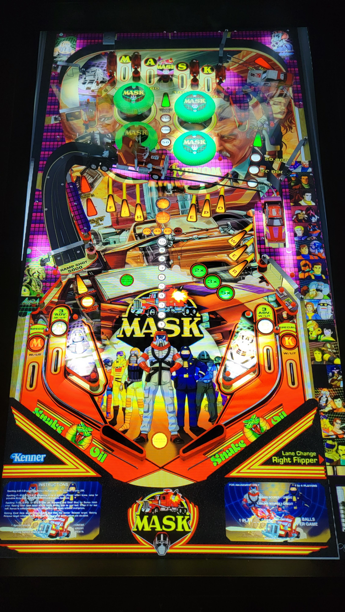

# Mask (Sound Mod) (Original 2023)

---

## Files
| File Type | Link | Version | Author | 
|-----------|--------|----------|--------------|
| **VPX** | [VP Universe](https://vpuniverse.com/files/file/15398-mask-musicmod/?tab=comments) | 1.0.0 | [nagaidevil](https://vpuniverse.com/profile/40780-nagaidevil/) |
| **B2S** | Included with table.zip | 1.0.0 | [nagaidevil](https://vpuniverse.com/profile/40780-nagaidevil/) |
| **ROM** | [VP Forums](https://www.vpforums.org/index.php?app=downloads&showfile=808) | fpwr2_l2.zip| [destruk](https://www.vpforums.org/index.php?showuser=5) |

**Tested by:** [TechZombie]

---

## Status 
**Minimum VPX Standalone build:** {vpx-standalone-build-#}

| Playfield | Controls | Backglass | DMD | ROM Required | FPS | 
|-----------|----------|-----------|-----|--------------|-----|
| :white_check_mark: | :white_check_mark: | :white_check_mark: | :white_check_mark: | :white_check_mark: | 50 |

---

## Instructions

- Copy the contents of this repo folder to your USB drive
- Add your personalized launcher.elf and rename it to `vpx-mask.elf`
- Download the table and included directb2s at the VPX link above.
- Copy the `.vpx` file, and the `MASK 2scr.directb2s` file both into `vpx-mask`
- Select/Copy `MASK` Folder and move to `vpx-mask/music`
- Rom file (fpwr2_l2.zip) stays in zip folder, place zip file in `vpx-mask/pinmame/roms`
- Make sure `(.vpx)` `(.direct2b2s)` `(.vbs)` and `(.ini)` are all named the same.
- "Let's roll, team!" - Matt Trakker

