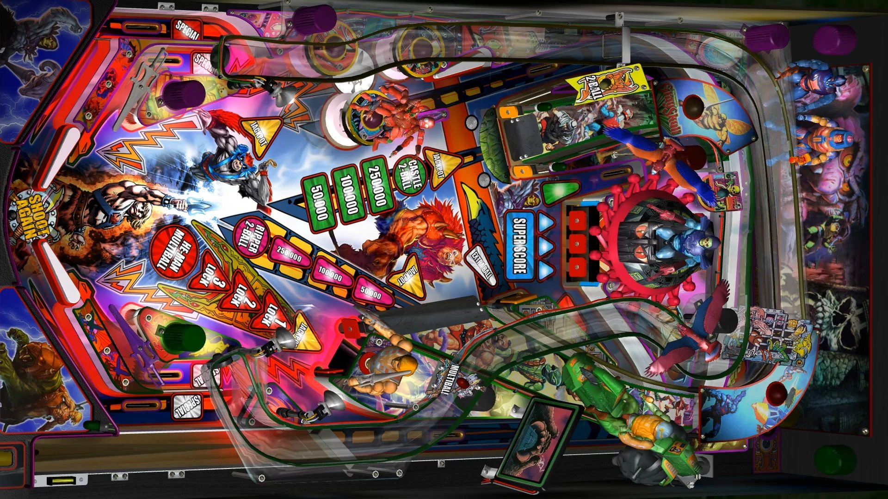

# Masters of the Universe (Original 2018)

-PF.jpg.df5cf3839d4baacbbf51309073f6348e.jpg)

Authors: [psiomicron](https://vpuniverse.com/profile/34108-psiomicron/)  
Download File Name: VR ROOM Masters of the Universe 1.1 Minimal.zip  
Filename: VR ROOM Masters of the Universe 1.1 Minimal.vpx  
Download: [VP Forums](https://vpuniverse.com/files/file/6075-vr-room-masters-of-the-universe-minimal/)

DirectB2S included with Table.

No ROM Needed for Table

Tested by: TechZombie

## Status 

Minimum VPX Standalone build: 10.8.0-1989-a764013

| Playfield | Controls | Backglass | DMD | ROM Required | FPS | 
|-----------|----------|-----------|-----|--------------|-----|
| :white_check_mark: | :white_check_mark: | :white_check_mark: | :white_check_mark: | :x: | 54 |

## Instructions

- Copy the contents of this repo folder to your USB drive
- Add your personalized launcher.elf and rename it to vpx-mastersoftheuniverse.elf
- Download the table zip (which also contains directb2s), extract and copy these two files to external/vpx-mastersoftheuniverse
- Make sure (.vpx), (.directb2s), (.ini), and (.vbs) files are all named the same
- MUSIC: Also in the table zip, there is a "Music heman" folder. Extract, then rename this folder to "Music" and copy the contents to external/vpx-mastersoftheuniverse
- MUSIC: The Music folder will then look like this: external/vpx-mastersoftheuniverse/Music (music files in Music)
- "By the power of Grayskull, I have the power!" - He-Man transforming

