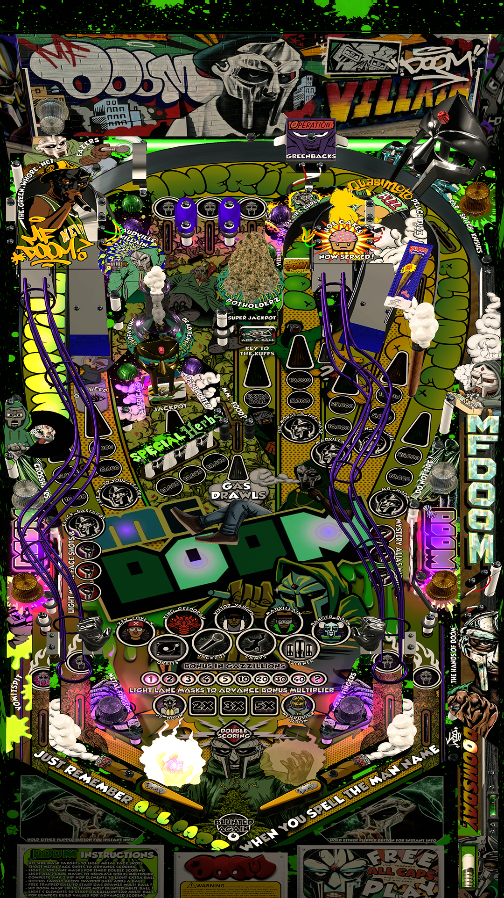

# MF DOOM (GOILL773 2024)

Tested by: Bla1ze & dr_wraith

Author: [VPinWorkShop](https://vpuniverse.com/profile/40692-vpinworkshop/)  
Version: 1.1  
Download: [VP Universe](https://vpuniverse.com/files/file/21045-mf-doom-goill773-2024/)

DirectB2S

This table uses a PUPPACK, so no b2s file is necessary.

ROM

Not Needed

## Status 

Minimum VPX Standalone build: 10.8.0-1983-a764013

| Playfield | Controls | Backglass | DMD | ROM Required | FPS | 
|-----------|----------|-----------|-----|--------------|-----|
| :white_check_mark: | :white_check_mark: | :white_check_mark: | :white_check_mark: | :x: | 35 |

## Instructions
 
- Copy the contents of this repository folder to your USB drive
- Place your personalized launcher.elf file on the USB drive and rename it to vpx-mfdoom.elf
- Download the MF DOOM table package and unzip it. From the MFDOOM package table folder, copy the .vpx table file to your /vpx-mfdoom folder
- Make sure (.vpx), (.ini) and (.vbs) files are all named the same
- From the MF DOOM package, navigate to the DMD folder and copy the MFDOOMDMD folder and paste it into your /vpx-mfdoom folder
	
	
 

<table>
  <tr>
    <td style="background-color: #FFDDDD; padding: 0; border-left: 4px solid #FF0000;">
      

        <strong>⚠️ WARNING ⚠️</strong>
      

      

        Manually added puppacks are not supported by the VPXS 4KP team We will not be able to help you diagnose issues until this puppack is in the Wizard
      

    </td>
  </tr>
</table>
	
 ## PUP Instructions
    
- In your vpx-mfdoom folder, create a new folder named pupvideos.
- Open the PupVideos folder from the MF DOOM package and unzip the MFDOOM-PuP-v1.1.zip file
- Inside the unzipped MMFDOOM-PuP-v1.1 folder will be a MFDOOM file, copy this folder into the pupvideos folder you created
	
 ## MUSIC Instructions
    
- In your vpx-mfdoom folder, create a folder named music
- Copy the MFDOOM folder from the MF DOOM package Music folder and place it inside the music folder you created
- **Note: Only two attract songs are included. To add more music, download additional tracks as instructed in the original MF DOOM table package readme file. Additional songs are optional but enhance the table experience**
	
## Finalize pupvideos Setup

- Unzip the use_these_pup.zip file
- Place the unzipped files inside your pupvideos/MFDOOM folder, and overwrite any files if prompted
