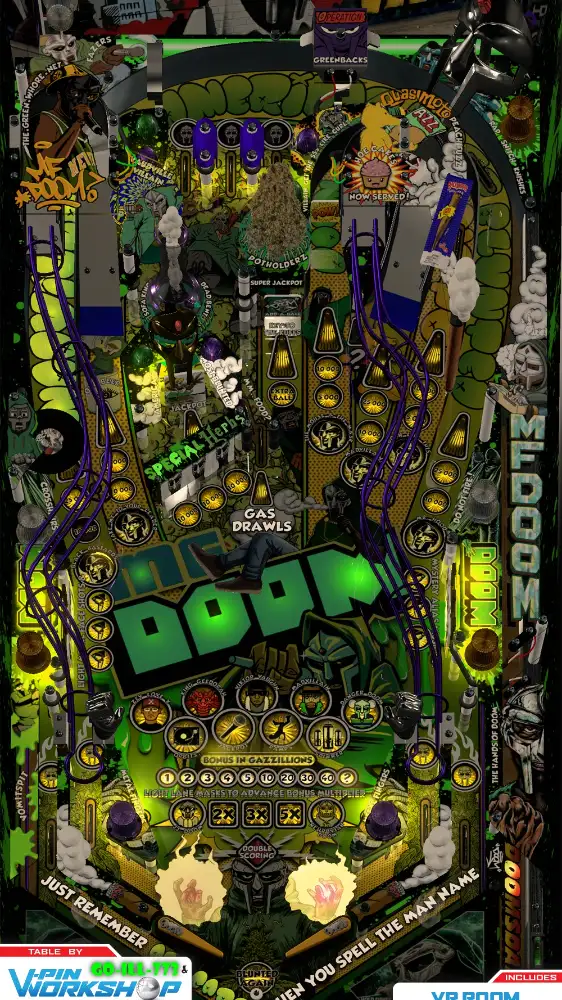

# MF Doom (Original 2024) FlexDMD version

---

## Files
| File Type | Link | Version | Author(s) | 
|-----------|--------|----------|--------------|
| **VPX** | [vpuniverse](https://vpuniverse.com/files/file/21045-mf-doom-goill773-2024/) | 1.1 | VPW, GoIll773, MerlinRTP |
| **B2S** | [vpuniverse](https://vpuniverse.com/files/file/21136-mf-doom-goill773-2024-b2s-for-2-screens/) | 1.0 | HauntFreaks |
| **VBS** | [github](https://github.com/jsm174/vpx-standalone-scripts/tree/master/MF%20DOOM%20(GOILL773%202024)%20v1.1) | 1.1 | jsm174 | 

**Tested by:** Curt

---

## Status 

| Backglass | DMD | ROM Required | Has Puppack | FPS |
|-----------|-----|-----|-----|-----|
| ✅ | ✅ | ❌ | ❌ | 58 |

---

## Instructions

- Install this table through the Table Manager, using the `Add Table` > `Manual` page
- If you need help, more information can be found on the wiki: [TM - Add Table - Manual](https://github.com/LegendsUnchained/vpx-standalone-alp4k/wiki/%5B04%5D-%F0%9F%A7%A1-TM-%E2%80%90-Other-Features#add-table---manual)
- Click `GO TO TABLE` after adding, and the TM will open to the relevant table folder.
- At that time, copy `MFDOOM-PKG-1.1/Music/` and `MFDOOM-PKG-1.1/DMD/MFDOOMDMD/` (the whole folders. FlexDMD is REQUIRED) from the table download zip, and `MF DOOM (GOILL773 2024) v1.1.vbs` from the GitHub link above, all to the vpx folder.
- Add as many of the optional music files listed in `MFDOOM-PKG-1.1/Install-README.txt` as you like to the Music folder.

- Say NO to drugs!

