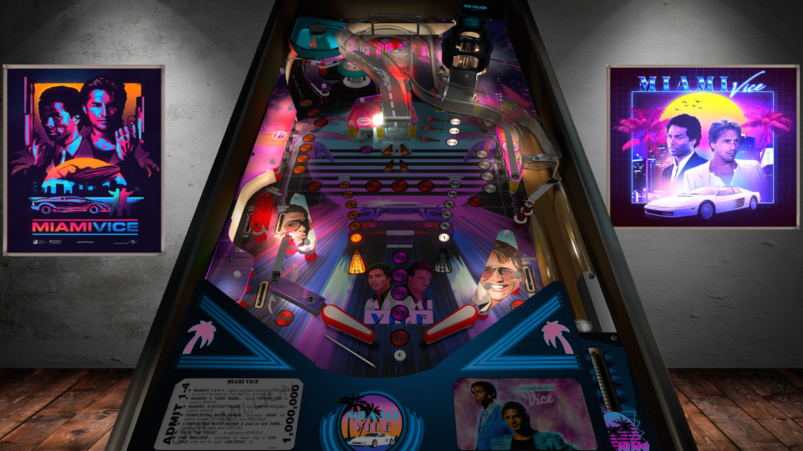

# Miami Vice (TBA 2020)

Author(s): [ivantba](https://www.vpforums.org/index.php?showuser=123858)  
Version:  Miami Vice (TBA 2020).zip Version 1.0
Download:  [VPUniverse](https://www.vpforums.org/index.php?app=downloads&showfile=14925)

DirectB2S

Version: 
Miami Vice (TBA 2020).vpx is included in Miami Vice (TBA 2020).zip

ROM:
comet_l5.zip

Author(s): [destruk](https://www.vpforums.org/index.php?showuser=5)
Download:  [VP Forums](https://www.vpforums.org/index.php?app=downloads&showfile=891)

Tested by:
[TechZombie]

## Status 

Minimum VPX Standalone build: 10.8.0-1983-b84441e
| Playfield | Controls | Backglass | DMD | ROM Required | FPS | 
|-----------|----------|-----------|-----|--------------|-----|
| :white_check_mark: | :white_check_mark: | :white_check_mark: | :white_check_mark: | :white_check_mark: | 37 |

## Instructions

- Install this table through the Table Manager, using the `Add Table` > `Manual` page
- If you need help, more infomation found on the wiki: [TM - Add Table - Manual](https://github.com/LegendsUnchained/vpx-standalone-alp4k/wiki/%5B04%5D-%F0%9F%A7%A1-TM-%E2%80%90-Other-Features#add-table---manual)
- If the table requires any additional files/steps, click `GO TO TABLE` after adding, and the TM will open to the relevant table folder.
- Open the Music file and copy the 8 .mp3 files into the music file on your USB drive.
- Go fire up your Vpin and enjoy!
- "The difference between men and boys is the price of their toys." ---Sonny Crockett

