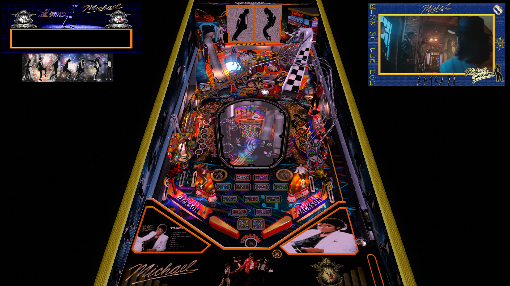

# Michael (Original 2026)

---

## Files
| File Type | Link | Version | Author | 
|-----------|--------|----------|--------------|
| **VPX** | [Vpuniverse](https://vpuniverse.com/files/file/30793-michael/) | 3.5 | [marty02](https://vpuniverse.com/profile/16531-marty02/) |
| **PUPPACK** | [included with table zip]

**Tested by:** [Rocjr73]

---

## Status 
**Minimum VPX Standalone build:** 10.8.0

| Backglass | DMD | ROM Required | Has Puppack | FPS |
|-----------|-----|-----|-----|-----|
| :x: | :white_check_mark: | :x: | :white_check_mark: | 60 |

---

## Instructions

<!-- IMPORTANT! DO NOT REMOVE OR EDIT THE FOLLOWING 3 STANDARD INSTRUCTIONS! -->
- Install this table through the Table Manager, using the `Add Table` > `Manual` page
- If you need help, more information found on the wiki: [TM - Add Table - Manual](https://github.com/LegendsUnchained/vpx-standalone-alp4k/wiki/%5B04%5D-%F0%9F%A7%A1-TM-%E2%80%90-Other-Features#add-table---manual)
- If the table requires any additional files/steps, click `GO TO TABLE` after adding, and the TM will open to the relevant table folder.
- Create a folder titled `pupvideos` in the Michael table folder
- Download the table with pup file Michael.zip version listed above.
- unzip the Pack Michael.zip on your computer the vpx.and pup is included in this zip 
- Open the michael folder and replace the playlist.pup, screens.pup, and triggers.pup (the files needed are on the vpuniverse download page. You need to scroll through the 1st page of comments and about halfway down you will see the 3 updated downloadable links for the settings for 2 screens + realDMD users (Without these updated files you will not have a working dmd with scores.
- After replacing those files add the Michael folder to the pupvideos folder you created in the Michael folder in the table manager. 
- Enjoy! "Hee-Hee!", "Shamone!"