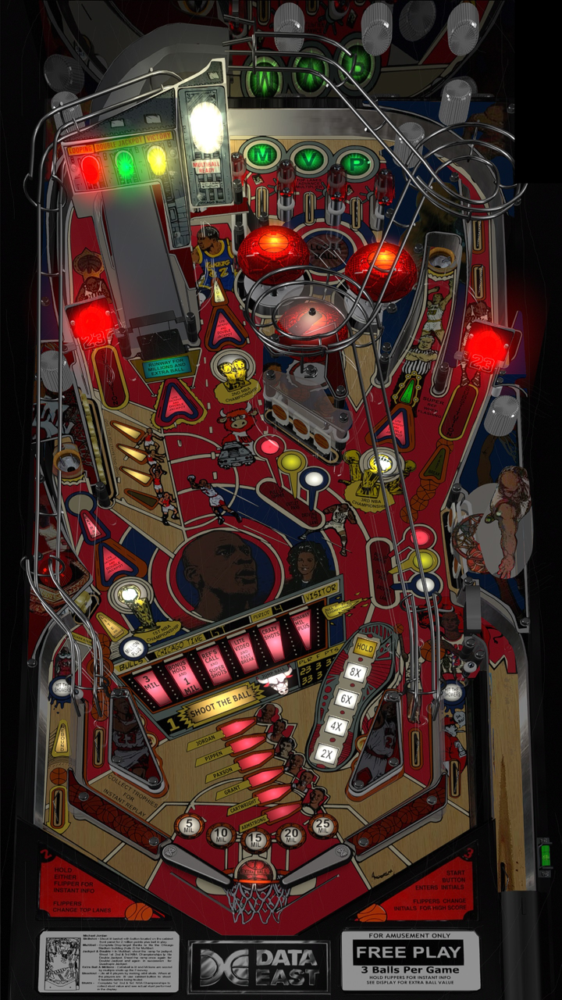

# Michael Jordan (Data East 1992)

Author: [Rascal](https://vpuniverse.com/profile/8-rascal/)

Version: 2.0.5 

Download: [VP Universe](https://vpuniverse.com/files/file/12632-michael-jordan-data-east-1992/)

DirectB2S
 
Author: [Wildman](https://vpuniverse.com/profile/5-wildman/)

Download: [VP Universe](https://vpuniverse.com/files/file/5926-michael-jordan-data-east-1992/)

ROM:

Download (mj_130.zip): [VP Universe](https://vpuniverse.com/files/file/5799-michael-jordan-130/)

MD5: 2be34108527558d1cd2b44ab85cd8c72

SHA: 3897507b3422b73186b61137758b354366591a85

## Status 

Minimum VPX Standalone build: 10.8.0-1983-b84441e
| Playfield | Controls | Backglass | DMD | ROM Required | FPS | 
|-----------|----------|-----------|-----|--------------|-----|
| :white_check_mark: | :white_check_mark: | :white_check_mark: | :white_check_mark: | :white_check_mark: | 45 |

## Instructions

- Copy the contents of this repo folder to your USB drive
- Add your personalized launcher.elf and rename it to vpx-michaeljordan.elf
- Download the table, ROM and directb2s versions listed above and copy them into this folder
- Make sure (.vpx), (.directb2s), (.ini) and (.vbs) files are all named the same
- Place mj_130.zip in the external/vpx-michaeljordan/pinmame/roms folder *Do Not unzip*
- The only game where Charles Barkley fights Godzilla! 🏀
