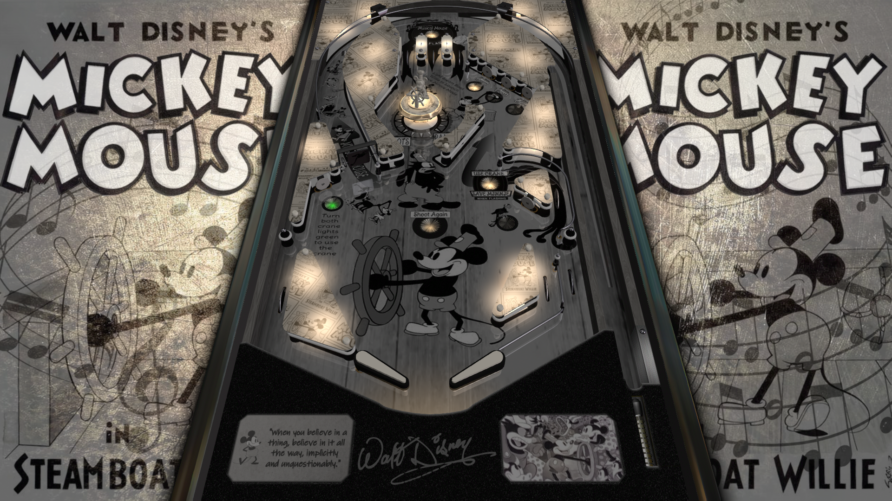

# Mickey Mouse in Steamboat Willie

            

Authors: [Manbearpig](https://vpuniverse.com/profile/32743-manbearpig/)  

Tested by: Mar3nBu

Version: 1  

Download: [VPUniverse](https://vpuniverse.com/files/file/9843-mickey-mouse-in-steamboat-willie-original-2022-manbearpig/)

DirectB2S

Included

## Status 

Minimum VPX Standalone build: 10.8.0-2006-6d603fb

| Playfield | Controls | Backglass | DMD | ROM Required | FPS | 
|-----------|----------|-----------|-----|--------------|-----|
| :white_check_mark: | :white_check_mark: | :white_check_mark: | :x: | :x: | 60 |

## Instructions

- Install this table through the Table Manager, using the `Add Table` > `Manual` page
- If you need help, more infomation found on the wiki: [TM - Add Table - Manual](https://github.com/LegendsUnchained/vpx-standalone-alp4k/wiki/%5B04%5D-%F0%9F%A7%A1-TM-%E2%80%90-Other-Features#add-table---manual)
- If the table requires any additional files/steps, click `GO TO TABLE` after adding, and the TM will open to the relevant table folder.

