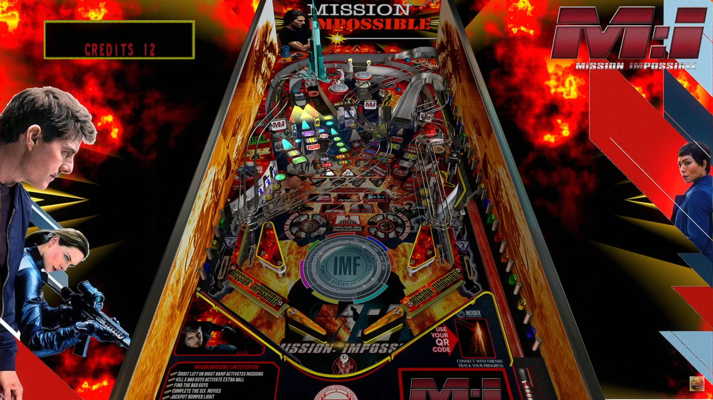

#  Mission Impossible Limited Edition (original 2022)

Author: [marty02](https://vpuniverse.com/profile/16531-marty02/)
  
Version: 2.6
  
Download: [VP Universe] (https://vpuniverse.com/files/file/12475-mission-impossible-limited-edition/)

DirectB2S:  
included with table download

ROM: None Needed

Tested by:  
[Silentkat]

## Status 

Minimum VPX Standalone build: 10.8.0-1983-b84441e

| Playfield | Controls | Backglass | DMD | ROM Required | FPS | 
|-----------|----------|-----------|-----|--------------|-----|
| :white_check_mark: | :white_check_mark: | :white_check_mark: | :white_check_mark: | :x: | 60 |

## Instructions

- Copy the contents of this repo folder to your USB drive
- Add your personalized launcher.elf and rename it to vpx-missionimp.elf
- Download the table and directb2s versions listed above, extract from packMI.zip and copy them into this folder (vpx-missionimp)
- Make sure (.vpx), (.directb2s), and (.ini) files are all named the same

- Your mission should you choose to accept it, is to try and survive in this very fast, high scoring table. The ball moves blazingly fast around this table in blink and you will miss it action! Play though all the movies and try and become Ethan Hunt! This message will self destruct in 5....4....3....2....1!
  
