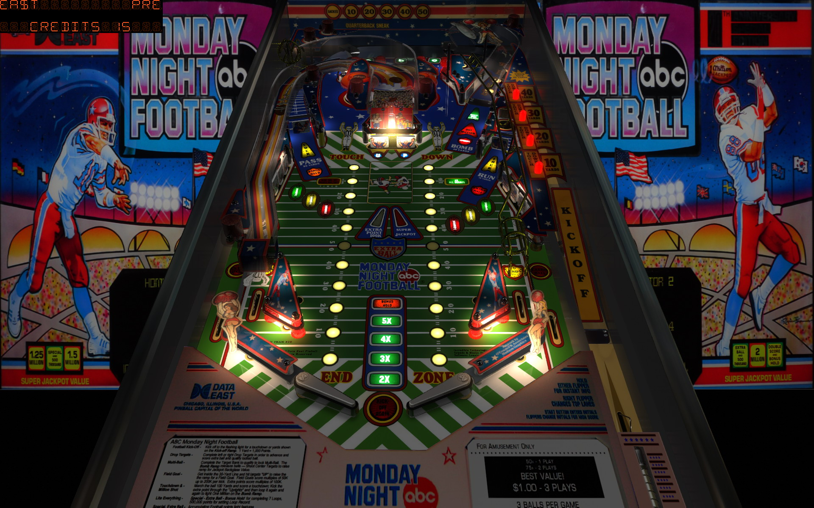

# Monday Night Football (Data East 1989)

Tested By: kaoticBPR

Authors: [bigus1](https://www.vpforums.org/index.php?showuser=107629)  
Version: 1.0  
Download: [VPForums](https://www.vpforums.org/index.php?s=9cc09b6e2bea6c841ac7c7621bfc7df2&app=downloads&showfile=16822)

DirectB2S

Authors: [wildman](https://vpuniverse.com/profile/5-wildman/)  
Version: 1.0.0  
Download: [VPUniverse](https://vpuniverse.com/files/file/6879-monday-night-football-data-east-1989/)

ROM

Download: [vpforums](http://www.vpforums.org/index.php?app=downloads&showfile=819)  
ROM Name and version: mnfb_c27

## Status 

Minimum VPX Standalone build: 10.8.0-1989-a764013

| Playfield | Controls | Backglass | DMD | ROM Required | FPS | 
|-----------|----------|-----------|-----|--------------|-----|
| :white_check_mark: | :white_check_mark: | :white_check_mark: | :white_check_mark: | :white_check_mark: | 42 |

## Instructions

- Make sure to use the Table Manager to install this table.
- Instructions can be found on the wiki [Add Table - Manual](https://github.com/LegendsUnchained/vpx-standalone-alp4k/wiki/%5B04%5D-%F0%9F%A7%A1-TM-%E2%80%90-Other-Features#add-table---manual)
- If the table requires any additional files/steps, click `GO TO TABLE` after adding, and the TM will open to the relevant table folder.
- "It's Time for some Football"

