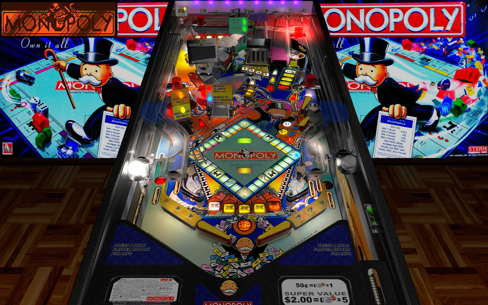

# Monopoly (Stern 2001)

Author: [bigus1](https://www.vpforums.org/index.php?showuser=107629)  
Version:  Monopoly (Stern 2001)_Bigus(MOD) 2.0  
Download: [VP Forums](https://www.vpforums.org/index.php?app=downloads&showfile=16734)

DirectB2S

Author: [ryguy417](https://vpuniverse.com/profile/31096-ryguy417/)  
Version: Monopoly (Stern 2001)  
Download: [VP Universe](https://vpuniverse.com/files/file/13105-monopoly-stern-2001-b2s-with-full-dmd/)

ROM: Monopoly (3.20)

Author: [destruk](https://www.vpforums.org/index.php?showuser=5)  
Version: monopoly.zip  
Download: [VP Forums](https://www.vpforums.org/index.php?app=downloads&showfile=7320)

Tested by:
[CoffeeAtJoes]

## Status 

Minimum VPX Standalone build: 10.8.0-1983-b84441e

| Playfield | Controls | Backglass | DMD | ROM Required | FPS | 
|-----------|----------|-----------|-----|--------------|-----|
| :white_check_mark: | :white_check_mark: | :white_check_mark: | :white_check_mark: | :white_check_mark: | 40 |

## Instructions

- Make sure to use the Table Manager to install this table.
- Instructions can be found on the wiki [Add Table - Manual](https://github.com/LegendsUnchained/vpx-standalone-alp4k/wiki/%5B04%5D-%F0%9F%A7%A1-TM-%E2%80%90-Other-Features#add-table---manual)
- If the table requires any additional files/steps, click `GO TO TABLE` after adding, and the TM will open to the relevant table folder.
- Now destroying families and friendships in the arcade! NO FLIPPING TABLES!

