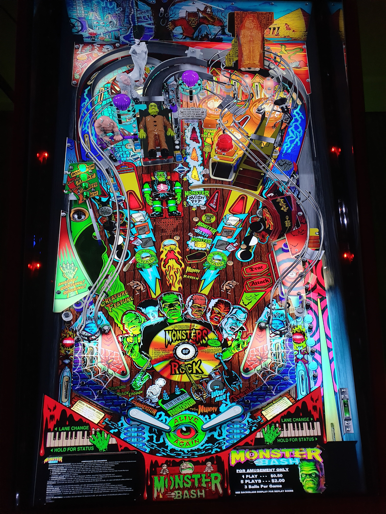

# Monster Bash (Williams 1998) Balutito Reskin

---

## Files
| File Type | Link | Version | Author | 
|-----------|--------|----------|--------------|
| **VPX** | [VP Universe](https://vpuniverse.com/files/file/9606-monster-bash-balutito-reskin-mod/) | 1.2 | [balutito](https://vpuniverse.com/profile/36070-balutito/) |
| **B2S** | [VP Universe](https://vpuniverse.com/files/file/2576-monster-bash-williams-1998/) | 1.0 | [Wildman](https://vpuniverse.com/profile/5-wildman/) |
| **ROM** | [VP Forums](https://www.vpforums.org/index.php?app=downloads&showfile=1285) | mb_106b.zip | [destruk](https://www.vpforums.org/index.php?showuser=5) |

---

## Status 
Minimum VPX Standalone build: 10.8.0-1989-a764013
| Playfield | Controls | Backglass | DMD | ROM Required | FPS | 
|-----------|----------|-----------|-----|--------------|-----|
| :white_check_mark: | :white_check_mark: | :white_check_mark: | :white_check_mark: | :white_check_mark: | 47 |

---

## Instructions

- Copy the contents of this repo folder to your USB drive
- Add your personalized launcher.elf and rename it to `vpx-monsterbashreskin.elf`
- Download the table and directb2s versions listed above, extract (if necessary) and copy them into `vpx-monsterbashreskin` folder
- Place ROM zip file into `vpx-monsterbashreskin/pinmame/roms` folder. DO NOT UNZIP!
- Make sure `(.vpx)`, `(.direct2b2s)` and `(.ini)` are named the same.

---

**Tested by:** psybocilin
