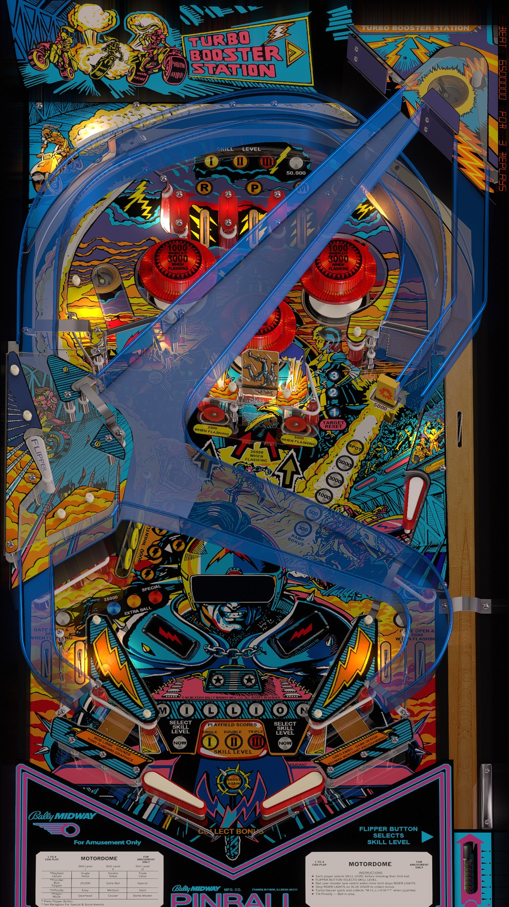

# Motordome (Bally 1986)

Authors: [jpsalas](https://www.vpforums.org/index.php?showuser=277)  
Version: 5.5.0  
Download: [VPForums](https://www.vpforums.org/index.php?app=downloads&showfile=16993)

DirectB2S

Authors: [hauntfreaks](https://vpuniverse.com/profile/5216-hauntfreaks/)  
Download: [VPUniverse](https://vpuniverse.com/files/file/14413-motordome-bally-1986-b2s/)

ROM

ROM Name: motrdome.zip  
Download: [VPForums](https://www.vpforums.org/index.php?app=downloads&showfile=713)  

SHA1: 456C025AB5436B587670BA02E26B1A92FE123A9C  
MD5:  9C2F08434930F74DE106906E2DEB7F4D

Tested by: evilwraith

## Status 

Minimum VPX Standalone build: 10.8.0-1989-a764013

| Playfield | Controls | Backglass | DMD | ROM Required | FPS | 
|-----------|----------|-----------|-----|--------------|-----|
| :white_check_mark: | :white_check_mark: | :white_check_mark: | :x: | :white_check_mark: | 55 |

## Instructions

- Install this table through the Table Manager, using the `Add Table` > `Manual` page
- If you need help, more infomation found on the wiki: [TM - Add Table - Manual](https://github.com/LegendsUnchained/vpx-standalone-alp4k/wiki/%5B04%5D-%F0%9F%A7%A1-TM-%E2%80%90-Other-Features#add-table---manual)
- If the table requires any additional files/steps, click `GO TO TABLE` after adding, and the TM will open to the relevant table folder.

