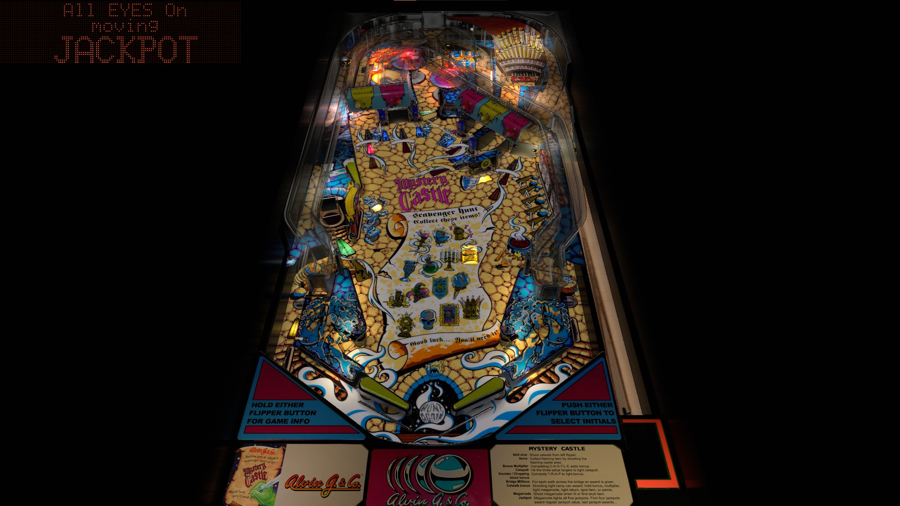

# Mystery Castle (Alvin G 1993)

Authors: [agentEighty6](https://vpuniverse.com/profile/25523-agenteighty6/)  
Version: 2.1.0  
Download: [VPUniverse](https://vpuniverse.com/files/file/6425-mystery-castle-alvin-g-1993/)

DirectB2S

Authors: [Wildman](https://vpuniverse.com/profile/5-wildman/)  
Download: [VPUniverse](https://vpuniverse.com/files/file/2829-mystery-castle-alvin-g-1993/)

ROM

ROM Name: mystcasa.zip  
Download: [VPForums](https://www.vpforums.org/index.php?app=downloads&showfile=6234)  

SHA1: FF92A529E1B6EB775501C7A412A24B17421CE176  
MD5:  A3551EA7C94F7B8C3891521786BCEA76

Tested by: evilwraith

## Status 

Minimum VPX Standalone build: 10.8.0-1989-a764013

| Playfield | Controls | Backglass | DMD | ROM Required | FPS | 
|-----------|----------|-----------|-----|--------------|-----|
| :white_check_mark: | :white_check_mark: | :white_check_mark: | :white_check_mark: | :white_check_mark: | 45 |

## Instructions

- Install this table through the Table Manager, using the `Add Table` > `Manual` page
- If you need help, more infomation found on the wiki: [TM - Add Table - Manual](https://github.com/LegendsUnchained/vpx-standalone-alp4k/wiki/%5B04%5D-%F0%9F%A7%A1-TM-%E2%80%90-Other-Features#add-table---manual)
- If the table requires any additional files/steps, click `GO TO TABLE` after adding, and the TM will open to the relevant table folder.

