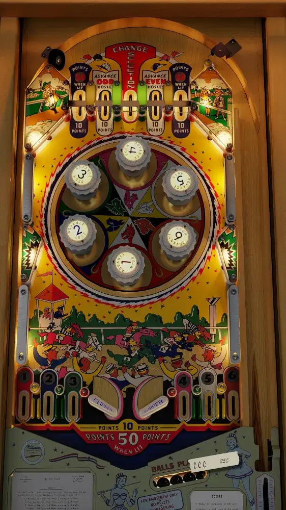

# Nags (Williams 1960)

---

## Files
| File Type | Link | Version | Author(s) | 
|-----------|--------|----------|--------------|
| **VPX** | [vpuniverse](https://vpuniverse.com/files/file/25126-nags-williams-1960/) | 1.00 | Scottacus, Bord, Roth |
| **B2S** | [vpuniverse](https://vpuniverse.com/files/file/25126-nags-williams-1960/) | 1.00 | Scottacus, Bord, Roth |

**Tested by:** Curt

---

## Status 

| Backglass | DMD | ROM Required | Has Puppack | FPS |
|-----------|-----|-----|-----|-----|
| ✅ | ❌ | ❌ | ❌ | 50 |

---

## Instructions

- Install this table through the Table Manager, using the `Add Table` > `Manual` page
- If you need help, more information can be found on the wiki: [TM - Add Table - Manual](https://github.com/LegendsUnchained/vpx-standalone-alp4k/wiki/%5B04%5D-%F0%9F%A7%A1-TM-%E2%80%90-Other-Features#add-table---manual)
- If the table requires any additional files/steps, click `GO TO TABLE` after adding, and the TM will open to the relevant table folder.
- After starting, continue to use the START button to dispense balls. Note that the flippers will not operate until a ball passes the first chute (this is how the physical table works).
- 'And they're off!'
