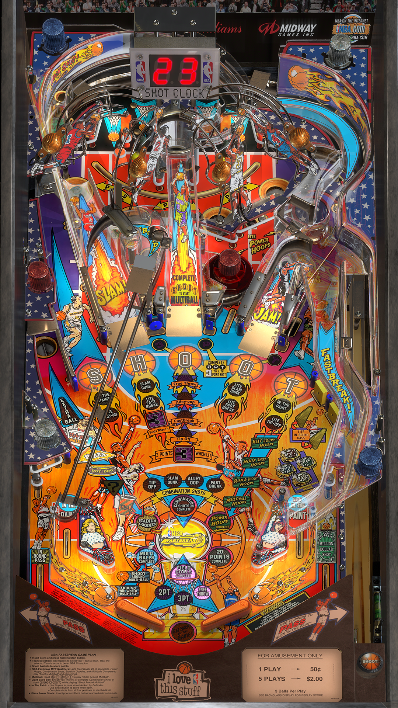

# NBA Fastbreak (Bally 1997)

Author: [VPinWorkshop](https://vpuniverse.com/profile/40692-vpinworkshop/)  

Tested by: Bla1ze

Version: 1.3

Download: [VP Universe](https://vpuniverse.com/files/file/6524-nba-fastbreak-bally-1997-vpw-mod/)

DirectB2S

Author: [Ruyguy417](https://vpuniverse.com/profile/31096-ryguy417/)  

Version: 2.0

Download: [VP Universe](https://vpuniverse.com/files/file/12980-nba-fastbreak-bally-1997-b2s-with-full-dmd/)

ROM

Download: [VP Forums](https://www.vpforums.org/index.php?app=downloads&showfile=1321)

SHA: 5f6ab55f2ed5aa82a54b02c56a3394de57c6058a

MD5: 8f5600db54396779eb35fdaec00b3b55955f1679

## Status 

Minimum VPX Standalone build: 10.8.0-1983-a764013
| Playfield | Controls | Backglass | DMD | ROM Required | FPS | 
|-----------|----------|-----------|-----|--------------|-----|
| :white_check_mark: | :white_check_mark: | :white_check_mark: | :white_check_mark: | :white_check_mark: | 35 |

## Instructions

- Copy the contents of this repo folder to your USB drive
- Add your personalized launcher.elf and rename it to vpx-nbafastbreak.elf
- Download the table, ROM and directb2s versions listed above and copy them into this folder
- Make sure (.vpx), (.directb2s), and (.ini) files are all named the same
- Place ROM zip file into vpx-nbafastbreak/pinmame/roms folder. DO NOT UNZIP!
- They Shoot, You Score! 🏀
