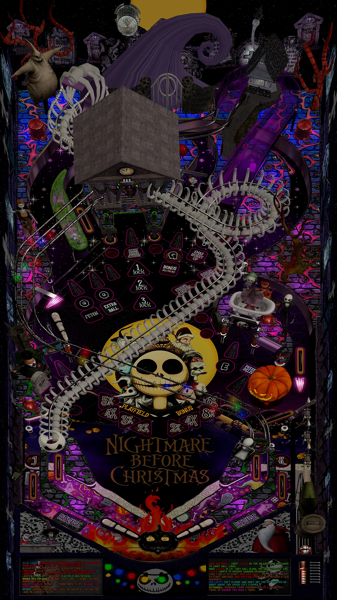

# Nightmare Before Christmas (Original 2024)

---

## Files
| File Type | Link | Version | Author | 
|-----------|--------|----------|--------------|
| **VPX** | [VPUniverse](https://vpuniverse.com/files/file/22643-nightmare-before-christmas2024/) | 1.0.2 | [tartzani](https://vpuniverse.com/profile/36680-tartzani/) |
| **B2S** | [VPUniverse](https://vpuniverse.com/files/file/22642-nightmare-before-christmas-original-2024-b2s-full-dmd/) | 1.0.0 |[hauntfreaks](https://vpuniverse.com/profile/5216-hauntfreaks//) |
| **DMD** | N/A | N/A | N/A |
| **ROM** | N/A | N/A | N/A |

**Tested by:** [Bla1ze]

---

## Status 
**Minimum VPX Standalone build:** 10.8.0-1983-b84441e
| Playfield | Controls | Backglass | DMD | ROM Required | FPS | 
|-----------|----------|-----------|-----|--------------|-----|
| :white_check_mark: | :white_check_mark: | :white_check_mark: | :white_check_mark: | :x: | 30 |

---

## Instructions

- Install this table through the Table Manager, using the `Add Table` > `Manual` page
- If you need help, more infomation found on the wiki: [TM - Add Table - Manual](https://github.com/LegendsUnchained/vpx-standalone-alp4k/wiki/%5B04%5D-%F0%9F%A7%A1-TM-%E2%80%90-Other-Features#add-table---manual)
- If the table requires any additional files/steps, click `GO TO TABLE` after adding, and the TM will open to the relevant table folder.
- WHAT'S THIS?

