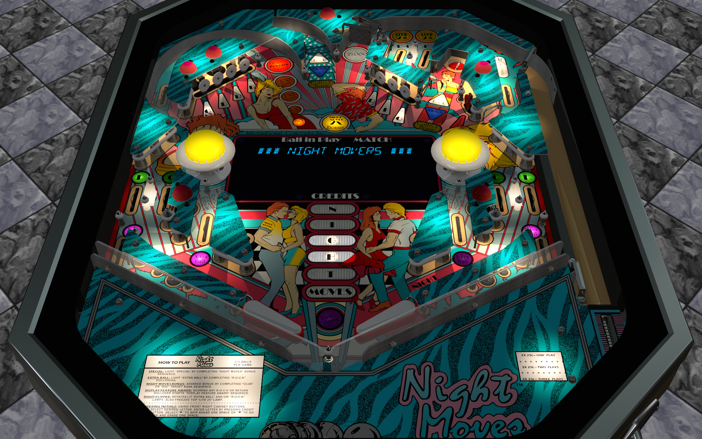

# Night Moves (International Concepts 1989)
Tested by: teh_pwn_slap

Authors: [kiwi](https://www.vpforums.org/index.php?showuser=30913)  
Version: 1.1.1  
Download: [vpforums](https://www.vpforums.org/index.php?app=downloads&showfile=14256)

DirectB2S

Authors: [roccodimarco, darquayle](https://www.vpforums.org/index.php?showuser=116076)  
Version: 1.0.0  
Download: [vpforums](https://www.vpforums.org/index.php?app=downloads&showfile=14257)

ROM

Download [IPDB](https://www.ipdb.org/files/3507/nmoves.zip)  
ROM Name and version: nmoves

## Status 

Minimum VPX Standalone build: 10.8.0-1989-a764013

| Playfield | Controls | Backglass | DMD | ROM Required | FPS | 
|-----------|----------|-----------|-----|--------------|-----|
| :white_check_mark: | :white_check_mark: | :white_check_mark: | :x: | :white_check_mark: | 47 |

## Instructions

- Install this table through the Table Manager, using the `Add Table` > `Manual` page
- If you need help, more information found on the wiki: [TM - Add Table - Manual](https://github.com/LegendsUnchained/vpx-standalone-alp4k/wiki/%5B04%5D-%F0%9F%A7%A1-TM-%E2%80%90-Other-Features#add-table---manual)
- If the table requires any additional files/steps, click `GO TO TABLE` after adding, and the TM will open to the relevant table folder.

