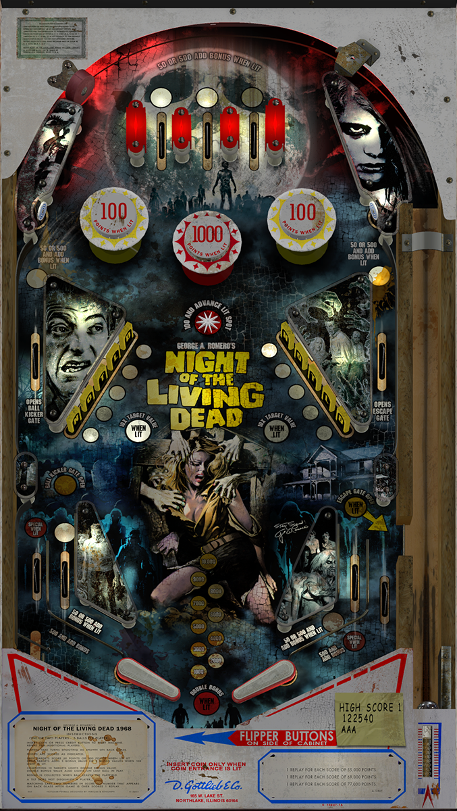

# Night of the Living Dead '68 (Original 2018) Grunge Mod

Authors: [HiRez00](https://vpuniverse.com/profile/19941-hirez00/)  
Download File: NOTLD-68_v1.2_Grunge_Mod.zip (1.2)  
Filename: NOTLD-68 (Original 2018) Grunge Mod v1.2.vpx  
Download: [VP Universe](https://vpuniverse.com/files/file/5156-night-of-the-living-dead-68-original-2018-mod/)

DirectB2S

Authors: [HiRez00](https://vpuniverse.com/profile/19941-hirez00/)  
Download File: NOTLD-68 Backglass.zip  
Filename: NOTLD-68 (Original 2018) Grunge Mod v1.2.directB2S  
Download: [VP Universe](https://vpuniverse.com/files/file/5156-night-of-the-living-dead-68-original-2018-mod/)

Music Located in Table Zip  
Filename: NOTLD-68-Music.zip

No Rom Needed for this Table

Tested by: TechZombie

## Status 

Minimum VPX Standalone build: 10.8.0-1989-a764013

| Playfield | Controls | Backglass | DMD | ROM Required | FPS | 
|-----------|----------|-----------|-----|--------------|-----|
| :white_check_mark: | :white_check_mark: | :white_check_mark: | :x: | :x: | 45 |

## Instructions

- Copy the contents of this repo folder to your USB drive
- Add your personalized launcher.elf and rename it to vpx-nightofthelivingdeadgrunge.elf
- Download the table and directb2s listed above, extract (if necessary) and copy them to external/vpx-nightofthelivingdeadgrunge
- Make sure (.vpx), (.directb2s), (.ini), and (.vbs) files are all named the same
- Unzip (NOTLD-68-Music.zip) Copy (Music) folder (Located inside NOTLD-68-Music) to vpx-nightofthelivingdeadgrunge
- "They're coming to get you, Barbara!" - Johnny
