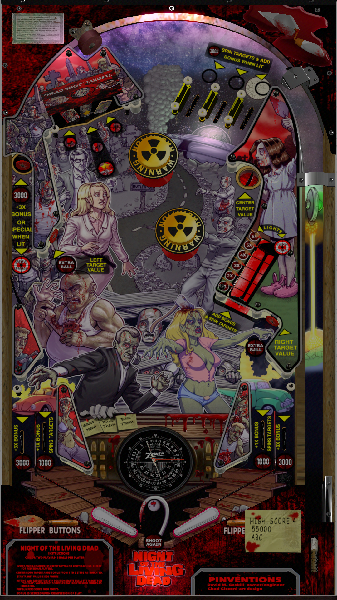

# Night of the Living Dead '68, Pinvention's (Original 2021)

Authors: [Shannon](https://vpuniverse.com/profile/7353-shannon/)  
Filename: Nightofthelivingdead_pimped.vpx (1.0.0)  
Download: [VP Universe](https://vpuniverse.com/files/file/7795-pinventions-night-of-the-living-dead/)

DirectB2S

Authors: [Shannon](https://vpuniverse.com/profile/7353-shannon/)  
Filename: Nightofthelivingdead.directb2s (1.0.0)  
Download: [VP Universe](https://vpuniverse.com/files/file/7795-pinventions-night-of-the-living-dead/)

Music

File/Folder-Name: 1652323682_NOTLDMUSIC.zip  
Download: [VP Universe](https://vpuniverse.com/files/file/7795-pinventions-night-of-the-living-dead/)

No Rom Needed for this Table

Tested by: TechZombie

## Status 

Minimum VPX Standalone build: 10.8.0-1989-a764013

| Playfield | Controls | Backglass | DMD | ROM Required | FPS | 
|-----------|----------|-----------|-----|--------------|-----|
| :white_check_mark: | :white_check_mark: | :white_check_mark: | :x: | :x: | 38 |

## Instructions

- Unzip (1652323682_NOTLDMUSIC.zip) Copy (NOTLD MUSIC) folder to vpx-nightofthelivingdeadpin -- Rename (NOTLD MUSIC) to (music).
- "Good shot! OK, he's dead; let's go get 'im. That's another one for the fire." - Sheriff McClelland

