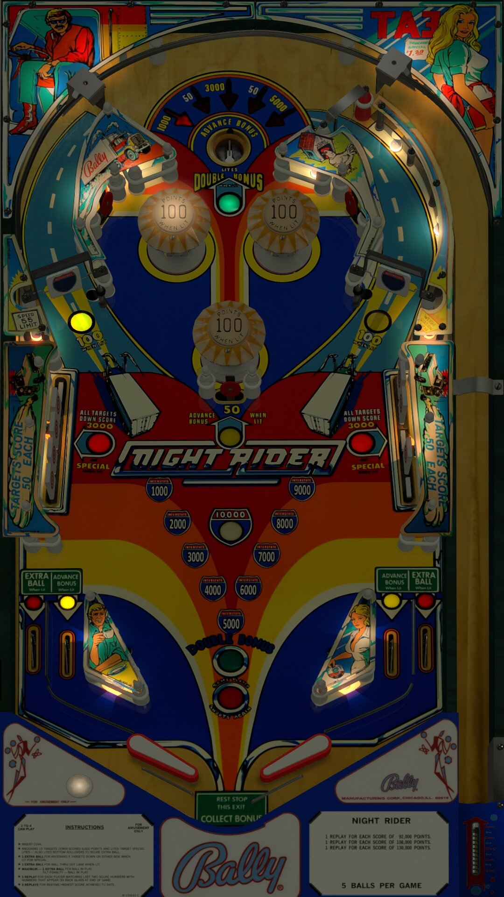

# Night Rider (Bally 1977)

Authors: [Goldchicco](https://vpuniverse.com/profile/23579-goldchicco/)  
Version: 2.0a  
Download: [VPUniverse](https://vpuniverse.com/files/file/7252-night-rider-bally-1977/)

DirectB2S

Authors: [hauntfreaks](https://vpuniverse.com/profile/5216-hauntfreaks/)  
Download: [VPUniverse](https://vpuniverse.com/files/file/14105-night-rider-bally-1977/)

ROM

ROM Name: nightrdr.zip  
Download: [VPUniverse](https://vpuniverse.com/files/file/690-nightrdrzip/)

SHA1: 39D2FBBBD97F143A0C865667AE9944CC13C258EC  
MD5:  142AA635E2B9A13AEE16AE1330AFC8C3

Tested by: evilwraith

## Status 

Minimum VPX Standalone build: 10.8.0-1989-a764013

| Playfield | Controls | Backglass | DMD | ROM Required | FPS | 
|-----------|----------|-----------|-----|--------------|-----|
| :white_check_mark: | :white_check_mark: | :white_check_mark: | :x: | :white_check_mark: | 60 |

## Instructions

- Install this table through the Table Manager, using the `Add Table` > `Manual` page
- If you need help, more information found on the wiki: [TM - Add Table - Manual](https://github.com/LegendsUnchained/vpx-standalone-alp4k/wiki/%5B04%5D-%F0%9F%A7%A1-TM-%E2%80%90-Other-Features#add-table---manual)
- If the table requires any additional files/steps, click `GO TO TABLE` after adding, and the TM will open to the relevant table folder.

