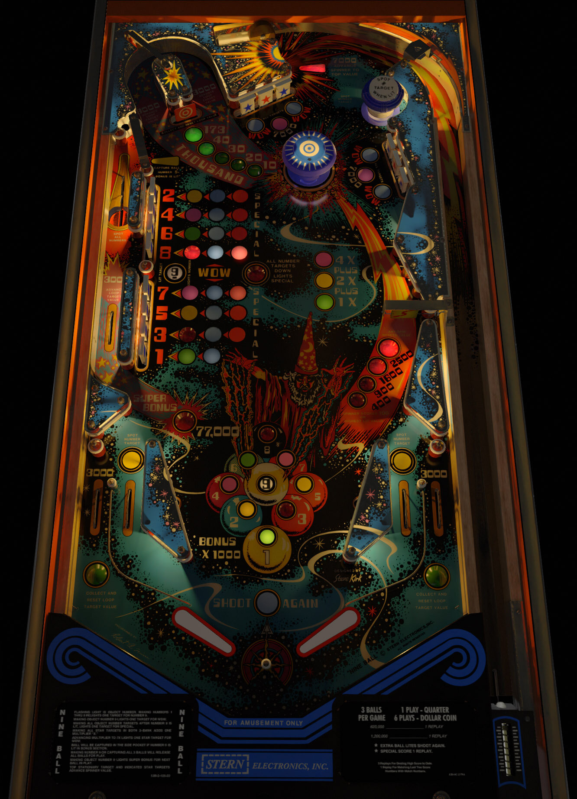

# Nine Ball (Stern 1980)

Authors: [bord](https://vpuniverse.com/profile/9265-bord/)  
Version: 1.0.0  
Download: [VPUniverse](https://vpuniverse.com/files/file/8520-nine-ball-stern-1980-sk-3/)

DirectB2S

Authors: [Wildman](https://vpuniverse.com/profile/5-wildman/)  
Download: [VPUniverse](https://vpuniverse.com/files/file/2199-nine-ballstern1980/)

ROM

ROM Name: nineball.zip  
Download: [VPForums](https://www.vpforums.org/index.php?app=downloads&showfile=747)  

SHA1: 77EAC2397836E484864E0FD45D1800E97E145437  
MD5:  2EB82664ACFF1AC2A35D25706D67AE16 

Tested by: evilwraith

## Status 

Minimum VPX Standalone build: 10.8.0-1989-a764013

| Playfield | Controls | Backglass | DMD | ROM Required | FPS | 
|-----------|----------|-----------|-----|--------------|-----|
| :white_check_mark: | :white_check_mark: | :white_check_mark: | :x: | :white_check_mark: | 45 |

## Instructions

