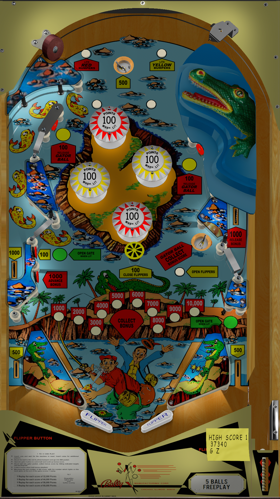

# Nip-It (Bally 1973)

Authors: [Mustang1961](https://www.vpforums.org/index.php?showuser=101607), [loserman76](https://www.vpforums.org/index.php?showuser=41250)\
Version: 1.0c\
Download: [VPForums](https://www.vpforums.org/index.php?app=downloads&showfile=16712)

#### DirectB2S

Authors: [hauntfreaks](https://vpuniverse.com/profile/5216-hauntfreaks/)\
Version: v1.5\
Download: [VPUniverse](https://vpuniverse.com/files/file/6621-nip-it-bally-1973-b2s/)

#### ROM

Not needed

Tested by: [GyroJoe](https://github.com/GyroJoe)

## Status 

Minimum VPX Standalone build: 10.8.0-2026-3b68d7c
| Playfield | Controls | Backglass | DMD | ROM Required | FPS | 
|-----------|----------|-----------|-----|--------------|-----|
| :white_check_mark: | :white_check_mark: | :white_check_mark: | :white_check_mark: | :x: | 54 |

## Instructions

- Copy the contents of this repo folder to your USB drive
- Add your personalized launcher.elf and rename it to `vpx-nipit.elf`
- Download the table and directb2s versions listed above and copy them into this folder
- Make sure the vpx, directb2s, ini, and vbs files are all named the "exact" same
- Right nudge button has been mapped to the Balligator
- "Pinball machines do not make me mad, I make them mad!"
