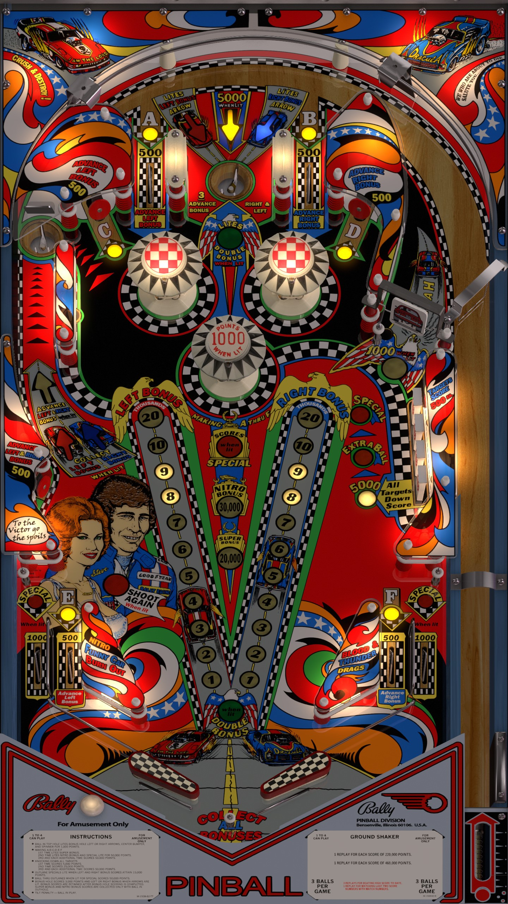

# Nitro Ground Shaker (Bally 1980)

Authors: [jpsalas](https://www.vpforums.org/index.php?showuser=277)  
Version: 5.5.0  
Download: [VPForums](https://www.vpforums.org/index.php?app=downloads&showfile=13598)

DirectB2S

Authors: [hauntfreaks](https://vpuniverse.com/profile/5216-hauntfreaks/)  
Download: [VPUniverse](https://vpuniverse.com/files/file/14380-nitro-ground-shaker-bally-1980-b2s/)

ROM

ROM Name: ngndshkb.zip  
Download: [VPForums](https://www.vpforums.org/index.php?app=downloads&showfile=685)  

SHA1: 9FA19F741DE4A390853909D9E63D8F3C87F3BBD0  
MD5:  C1BECAE497A7DBDAC350368E3A71E8F5

Tested by: evilwraith

## Status 

Minimum VPX Standalone build: 10.8.0-1989-a764013

| Playfield | Controls | Backglass | DMD | ROM Required | FPS | 
|-----------|----------|-----------|-----|--------------|-----|
| :white_check_mark: | :white_check_mark: | :white_check_mark: | :x: | :white_check_mark: | 60 |

## Instructions

- Make sure to use the Table Manager to install this table.
- Instructions can be found on the wiki [Add Table - Manual](https://github.com/LegendsUnchained/vpx-standalone-alp4k/wiki/%5B04%5D-%F0%9F%A7%A1-TM-%E2%80%90-Other-Features#add-table---manual)
- If the table requires any additional files/steps, click `GO TO TABLE` after adding, and the TM will open to the relevant table folder.

