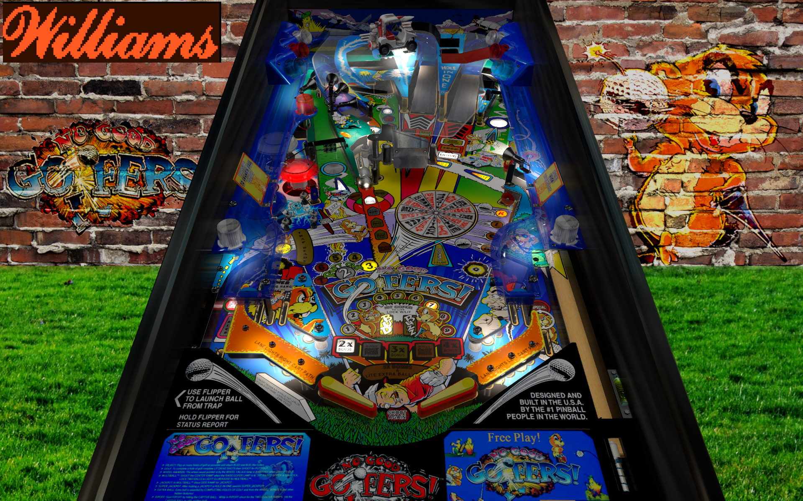

# No Good Gofers! (Williams 1997)
Tested by: kaoticBPR

Authors: [Bigus1](https://www.vpforums.org/index.php?showuser=107629)
Version: 2.1
Download: [vpforums](https://www.vpforums.org/index.php?app=downloads&showfile=16148)

DirectB2S

Authors: [hauntfreaks](https://vpuniverse.com/profile/5216-hauntfreaks/)
Version: 1.0.0
Download: [VP Universe](https://vpuniverse.com/files/file/12418-no-good-gofers-williams-1997-b2s-with-full-dmd/)

ROM

Download: [vpforums](https://www.vpforums.org/index.php?app=downloads&showfile=1194)

## Status 

Minimum VPX Standalone build: 10.8.0-1989-a764013
| Playfield | Controls | Backglass | DMD | ROM Required | FPS | 
|-----------|----------|-----------|-----|--------------|-----|
| :white_check_mark: | :white_check_mark: | :white_check_mark: | :white_check_mark: | :white_check_mark: | 42 |

## Instructions

- Install this table through the Table Manager, using the `Add Table` > `Manual` page
- If you need help, more infomation found on the wiki: [TM - Add Table - Manual](https://github.com/LegendsUnchained/vpx-standalone-alp4k/wiki/%5B04%5D-%F0%9F%A7%A1-TM-%E2%80%90-Other-Features#add-table---manual)
- If the table requires any additional files/steps, click `GO TO TABLE` after adding, and the TM will open to the relevant table folder.
- "Damn those no good gofers!"

