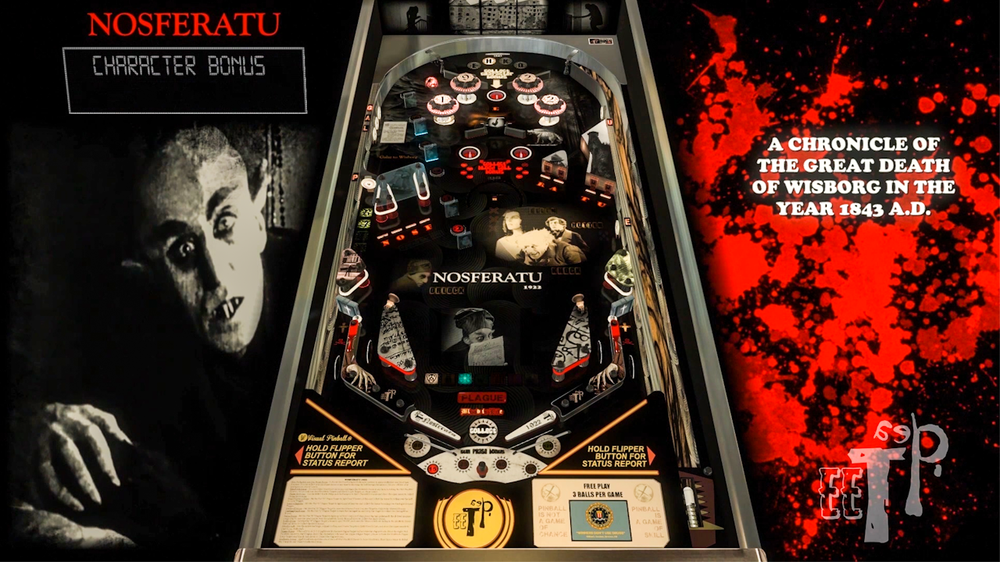

# Nosferatu 1922 (Original 2023)

Authors: [DAMONRA](https://vpuniverse.com/profile/48356-damonra/content/?type=downloads_file)  
Version: 1.0.0 Nosferatu 1922 (dea TEE Original VPX 2023) v1.0.zip  
Filename: Nosferatu 1922 (dea TEE Original VPX 2023) v1.0.vpx  
Download: [VP Universe](https://vpuniverse.com/files/file/16413-nosferatu-1922-original-2023/)

DirectB2S

Authors: [icepinball](https://vpuniverse.com/profile/4306-icepinball/)  
Filename: (1.0.0) Nosferatu 1922.directb2s  
Download: [VP Universe](https://vpuniverse.com/files/file/16415-nosferatu-1922-backgass-iceman-2023/)

No ROM Needed for this Table.

Fixed and Tested by: TechZombie

## Status 

Minimum VPX Standalone build: 10.8.0-1989-a764013

| Playfield | Controls | Backglass | DMD | ROM Required | FPS | 
|-----------|----------|-----------|-----|--------------|-----|
| :white_check_mark: | :white_check_mark: | :white_check_mark: | :white_check_mark: | :x: | 60 |

## Instructions

- Make sure to use the Table Manager to install this table.
- Instructions can be found on the wiki [Add Table - Manual](https://github.com/LegendsUnchained/vpx-standalone-alp4k/wiki/%5B04%5D-%F0%9F%A7%A1-TM-%E2%80%90-Other-Features#add-table---manual)
- If the table requires any additional files/steps, click `GO TO TABLE` after adding, and the TM will open to the relevant table folder.
- "Your wife has such a beautiful neck..." - Graf Orlok

