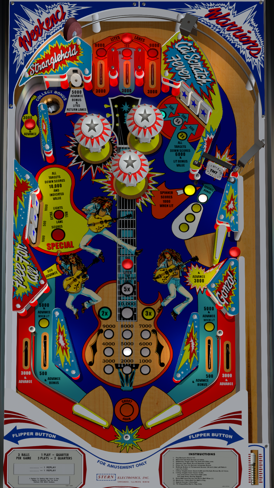

# Nugent (Stern 1978)

Author(s): [WED21](https://vpuniverse.com/profile/11990-wed21/)  
Version:  Nugent (Stern 1978) 2.2  
Download:  [VP Universe](https://vpuniverse.com/files/file/6370-nugent-stern-1978-22/)

DirectB2S

Authors: [Hauntfreaks](https://vpuniverse.com/profile/5216-hauntfreaks/)  
Version: Nugent (Stern 1978) b2s  
Download: [VP Universe](https://vpuniverse.com/files/file/17954-nugent-stern-1978-b2s/)

ROM

Authors: [destruk](https://www.vpforums.org/index.php?showuser=5)  
Filename: nugent.zip  
Download: [VP Forums](https://www.vpforums.org/index.php?app=downloads&showfile=732)

Tested by:  
[HereForGear]

## Status 

Minimum VPX Standalone build: 10.8.0-1983-b84441e

| Playfield | Controls | Backglass | DMD | ROM Required | FPS | 
|-----------|----------|-----------|-----|--------------|-----|
| :white_check_mark: | :white_check_mark: | :white_check_mark: | :x: | :white_check_mark: | 60 |

## Notes

- DMD on backglass

## Instructions

- Install this table through the Table Manager, using the `Add Table` > `Manual` page
- If you need help, more infomation found on the wiki: [TM - Add Table - Manual](https://github.com/LegendsUnchained/vpx-standalone-alp4k/wiki/%5B04%5D-%F0%9F%A7%A1-TM-%E2%80%90-Other-Features#add-table---manual)
- If the table requires any additional files/steps, click `GO TO TABLE` after adding, and the TM will open to the relevant table folder.
- "Wango Tango!"

