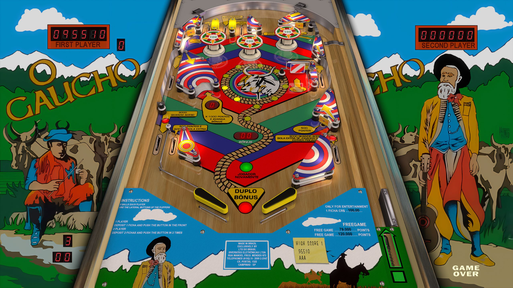

# O Gaucho (LTD do Brasil 1975)

---

## Files
| File Type | Link | Version | Author | 
|-----------|--------|----------|--------------|
| **VPX** | [VPForums](https://www.vpforums.org/index.php?app=downloads&showfile=17380) | 5.5.0 | [jpsalas](https://www.vpforums.org/index.php?showuser=277) |
| **B2S** | `O Gaucho (LTD do Brasil 1975).directb2s` included in VPX link |

**Tested by:** Curt

---

## Status 
**Minimum VPX Standalone build:** 10.8.0-5b941e6

| Playfield | Controls | Backglass | DMD | ROM Required | FPS | 
|-----------|----------|-----------|-----|--------------|-----|
| :white_check_mark: | :white_check_mark: | :white_check_mark: | :x: | :x: | 60 |

---

## Instructions

- Copy the contents of this repo folder to your USB drive
- Add your personalized launcher.elf and rename it to `vpx-ogaucho.elf`
- Download the table and directb2s versions listed above, extract, and copy them into `vpx-ogaucho`
- Make sure `(.vpx)` `(.directb2s)` `(.vbs)` and `(.ini)` are all named the same.
