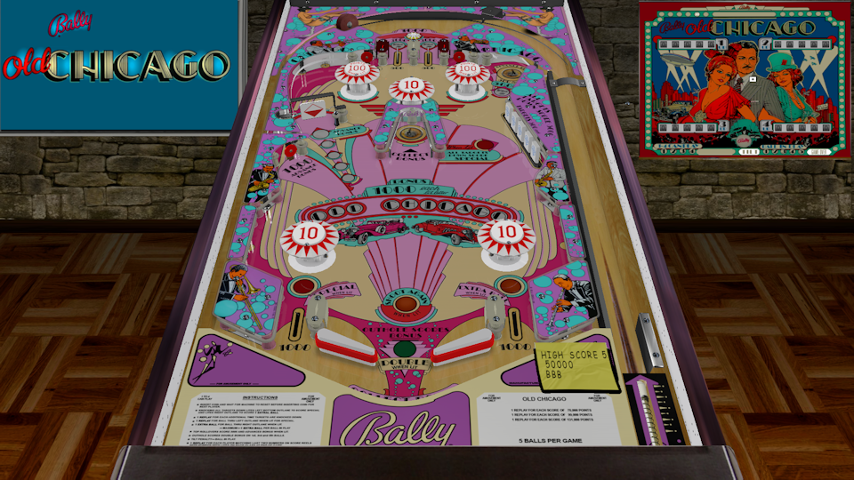

# Old Chicago (Bally 1976)

---

## Files
| File Type | Link | Version | Author | 
|-----------|--------|----------|--------------|
| **VPX & B2S** | [VP Forums](https://www.vpforums.org/index.php?app=downloads&showfile=13266) | 1.0b | [loserman76](https://www.vpforums.org/index.php?showuser=41250) |

---

## Status 
Minimum VPX Standalone build: 10.8.0-1989-a764013

| Playfield | Controls | Backglass | DMD | ROM Required | FPS | 
|-----------|----------|-----------|-----|--------------|-----|
| :white_check_mark: | :white_check_mark: | :white_check_mark: | :x: | :x: | 58 |

---

## Instructions

- Copy the contents of this repo folder to your USB drive
- Add your personalized launcher.elf and rename it to `vpx-oldchicago.elf`
- Download the table and directb2s versions listed above, extract (if necessary) and copy them into `external/vpx-oldchicago` folder
- Make sure `(.vpx)`, `(.directb2s)` `(.vbs)` and `(.ini)` are all named the same.
- When game is not in progress, hold down the left flipper to bring up the options menu. Left flipper selects item, right flipper changes option.

---

**Tested by:** Shaver
