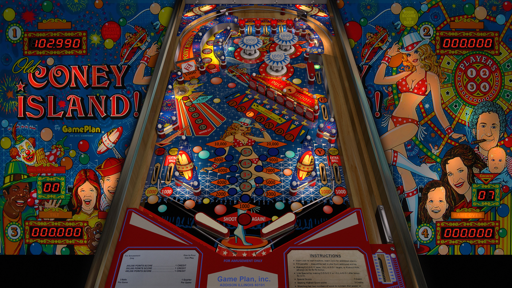

# Old Coney Island (Game Plan 1979)

Tested by: kaoticBPR

Authors: [JPSalas](https://www.vpforums.org/index.php?showuser=277)  
Version: 4.0.2  
Download: [VPForums](https://www.vpforums.org/index.php?app=downloads&showfile=12546)

DirectB2S

Authors: [STAT](https://www.vpforums.org/index.php?showuser=11253)  
Version: 1.2  
Download: [VPForums](https://www.vpforums.org/index.php?app=downloads&showfile=12547)

ROM

Download: [vpforums](https://www.vpforums.org/index.php?app=downloads&showfile=536)  
ROM Name and version: coneyis

## Status 

Minimum VPX Standalone build: 10.8.0-1989-a764013

| Playfield | Controls | Backglass | DMD | ROM Required | FPS | 
|-----------|----------|-----------|-----|--------------|-----|
| :white_check_mark: | :white_check_mark: | :white_check_mark: | :x: | :white_check_mark: | 60 |

## Instructions

- Install this table through the Table Manager, using the `Add Table` > `Manual` page
- If you need help, more infomation found on the wiki: [TM - Add Table - Manual](https://github.com/LegendsUnchained/vpx-standalone-alp4k/wiki/%5B04%5D-%F0%9F%A7%A1-TM-%E2%80%90-Other-Features#add-table---manual)
- If the table requires any additional files/steps, click `GO TO TABLE` after adding, and the TM will open to the relevant table folder.
- "Big Family Fun at Old Coney Island"

